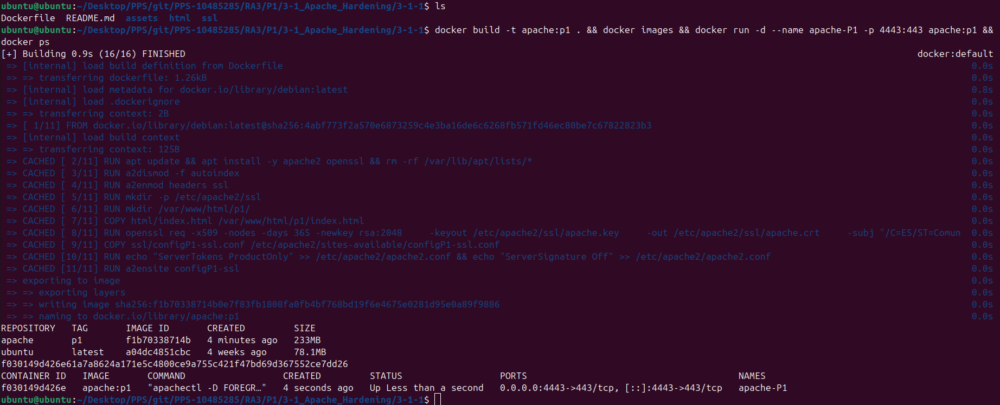
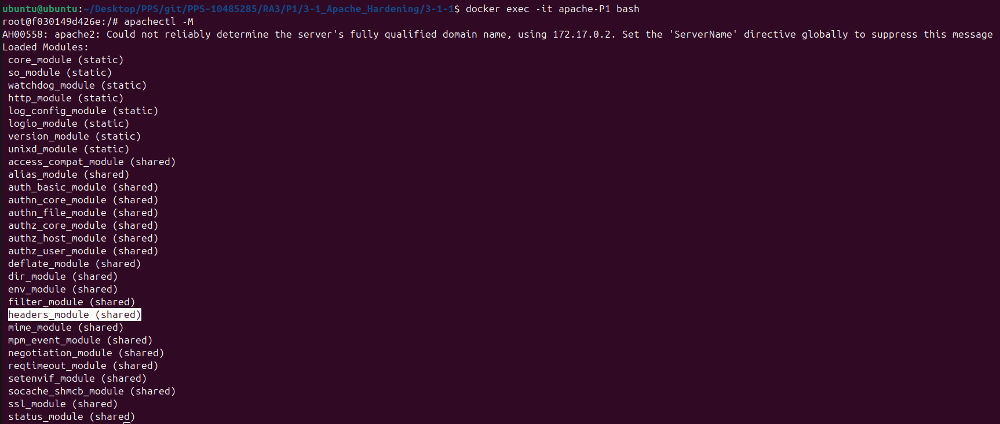
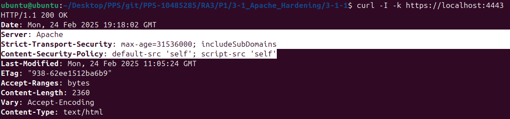

# 3.1.1

## Creación del container

Para realizar este ejercicio, nos podemos bajar la imagen directamente de dockerhub

	docker pull pps10485285/ra3:3-1-1

O ejecutar los siguientes comandos para construirla desde el Dockerfile facilitado:

Creamos una imagen de Docker a partir del Dockerfile 

	docker build -t apache:p1 .

Creamos el contenedor y lo ejecutamos 

	docker run -d --name apache-P1 -p 4443:443 apache:p1

Accedemos a nuestro Container desde el navegador:

[Acceso](https://localhost:4443)

## Comprobaciones

###Módulo autoindex deshabilitado

	docker exec -it apache-P1 bash

	apachectl -M | grep autoindex

	apachectl -M > Buscar autoindex y no encontrar el modulo 
	
###Módulo headers habilitado

	apachectl -M | grep headers

	apachectl -M > Buscar headers_module (shared)

###Verificar la cabecera HSTS (Strict-Transport-Security)

        curl -I -k https://localhost:4443

Donde el resultado esperado es:

	Strict-Transport-Security: max-age=31536000; includeSubDomains

###Verificar la cabecera CSP (Content-Security-Policy)

	curl -I -k https://localhost:4443

Donde el resultado esperado es:
	
	Content-Security-Policy: default-src 'self'; script-src 'self'

