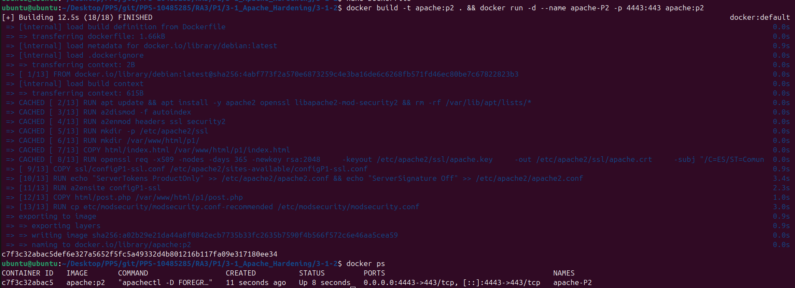
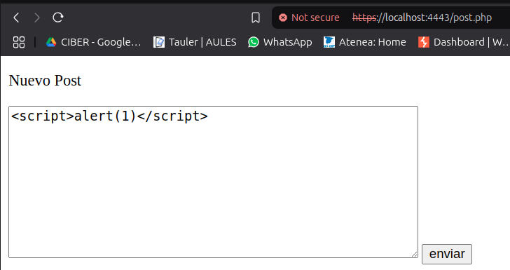
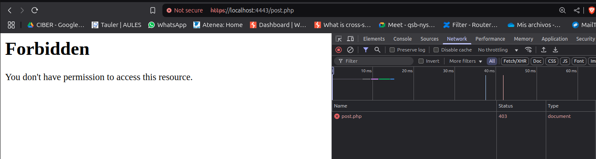
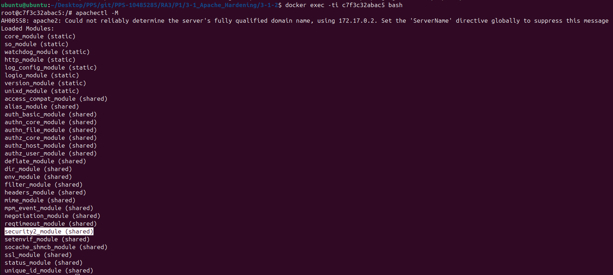

# 3-1-2

## Creación del container
Para realizar este ejercicio, nos podemos bajar la imagen directamente de dockerhub 

	docker pull pps10485285/ra3:3-1-2

O ejecutar los siguientes comandos para construirla desde el Dockerfile facilitado:

Creamos una imagen de Docker a partir del Dockerfile 

	docker build -t apache:p2 .

Creamos el contenedor y lo ejecutamos 

	docker run -d --name apache-P2 -p 4443:443 apache:p2

## Comprobaciones

Accedemos a nuestro Container desde el navegador al formulario post.php:

[https://localhost:4443/post.php](https://localhost:4443/post.php)

Una vez dentro, vamos a probar que no somos vulnerables ante ataques XSS indicando en el formulario el siguiente contenido

	

Y tras pulsar el botón de enviar, podemos observar que no funciona la ejecución del script:

Esto ha sido grácias al módulo de seguridad instalado en la creación de la imagen del Docker:

