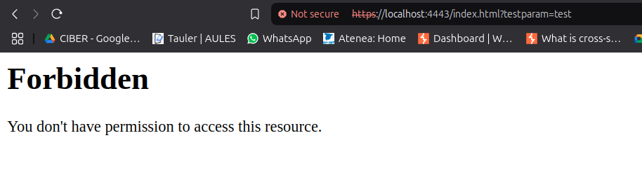
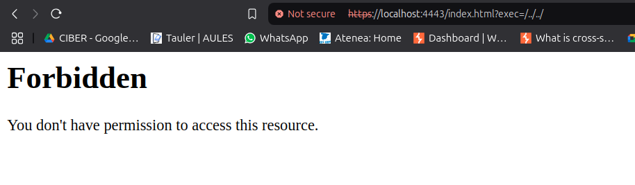
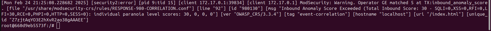

# 3-1-3

## Creación del container
Para realizar este ejercicio, nos podemos bajar la imagen directamente de dockerhub 

	docker pull pps10485285/ra3:3-1-3

O ejecutar los siguientes comandos para construirla desde el Dockerfile facilitado:

Creamos una imagen de Docker a partir del Dockerfile 

	docker build -t apache:p3 .

Creamos el contenedor y lo ejecutamos 

	docker run -d --name apache-P3 -p 4443:443 apache:p3

Accedemos a nuestro Container desde el navegador:

[https://localhost:4443](https://localhost:4443)

## Comprobaciones

En este apartado, vamos a realizar una serie de pruebas para verificar que no somos vulnerables a una serie de ataques tras la instalación de reglas OWASP:

### Comprobación del funcionamiento de las reglas

### Command Injection

### Path Traversal

## Visualización de logs

