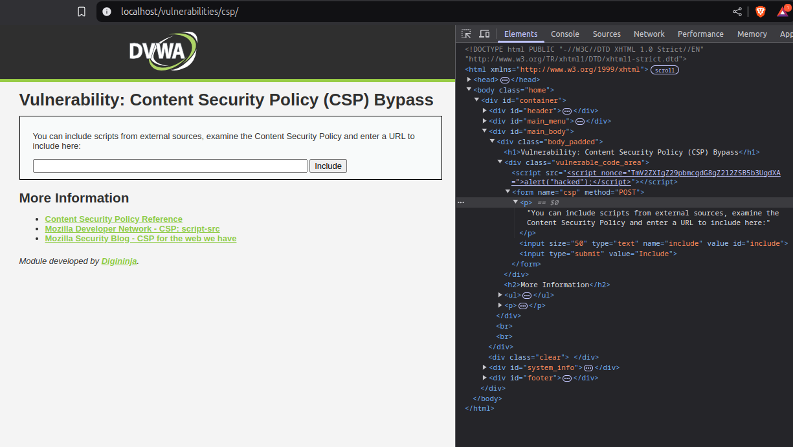
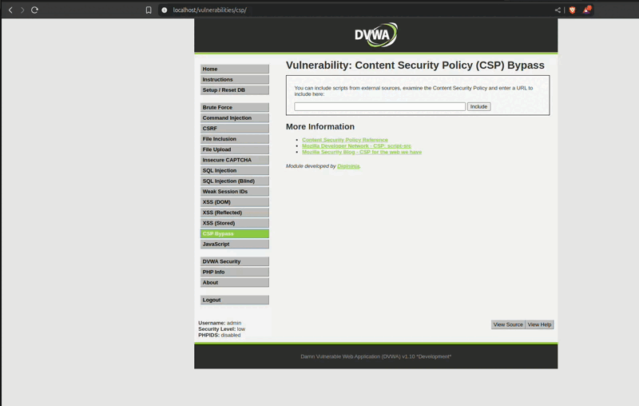

# 2.10-CSP

La finalidad de este ejercicio, es realizar el análisis de un codigo malicioso pasandole el contenido del mismo directamente, o a través de una URL donde procederá a la descarga del código y a su ejecución. En este caso hemos realizado un test indicandole el código malicioso directamente e indicando el enlace RAW de pastebin donde se ha indicado el codigo. Tras realizar la lectura de varios resources con writeups de este apartado, se ha llegado a la conclusión que no se puede realizar, o por lo menos en la versión 1.10

[Enlace Video](./images/pruebaError.mp4)
[Link 1](https://aftabsama.com/writeups/dvwa/content-security-policy-csp-bypass/)

[Link 2](https://puriayush29.medium.com/dvwa-csp-bypass-4a746830d5a1)

