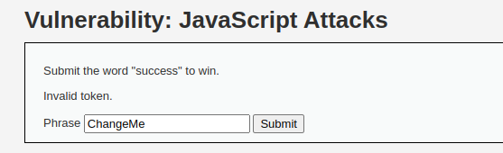
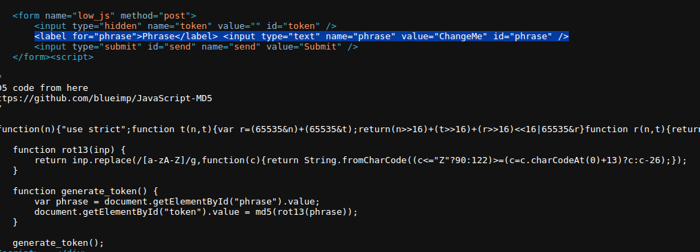
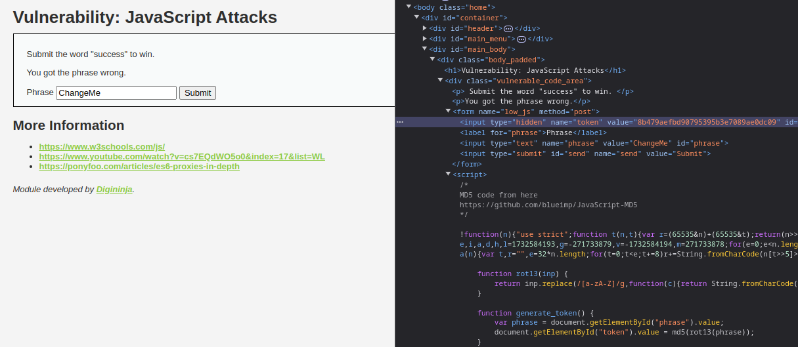
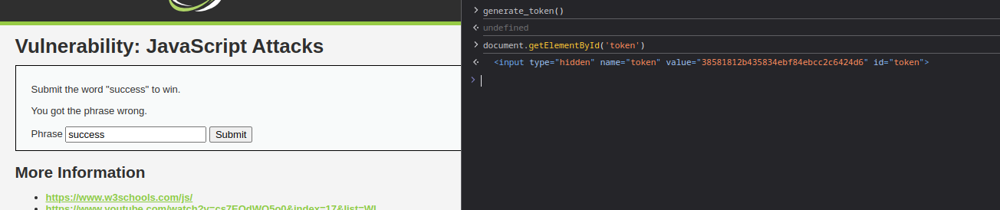
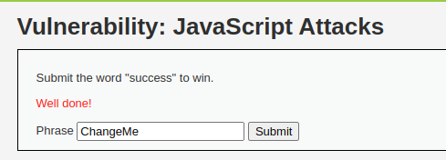

# 2.11-JS Attack

## LOW
En esta práctica, vamos a comprobar si somos vulnerables a ataques de JS. Para ello, nos presentan una ventana donde deberemos enviar la palabra success para ganar. Si escribimos dicha palabra y al enviamos, obtenemos un mensaje diciendonos que el token es invalido:

Si accedemos a ver el codigo html, podemos observar que hay un input oculto con la variable "token" y un generador de token que suponemos que es el que enviará en base al valor de la variable "Phrase":

Como podemos observar, dicho valor va a ser siempre "ChangeMe" y como no es success, nunca podremos superar el reto:

Es por eso que vamos a probar a indicar la palabra que necesitamos para ganar y a partir de ahí, acceder a la consola del navegador para ejecutar el codigo para la generación del token:

Una vez generado el token, podemos observar que ha cambiado su valor, es por ello que si realizamos el submit, podemos observar que se ha superado el nivel:

