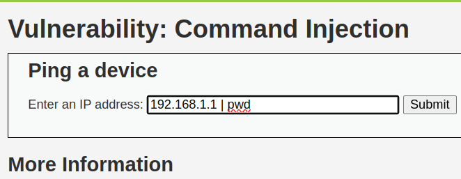
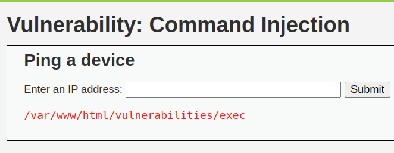

Para este caso, simplemente vamos a acceder a la página web de nuestra DVWA al apartado de Command Injection

[Enlace](http://localhost/vulnerabilities/exec/)

Una vez dentro, para poder testear el command injection, vamos a indicar una dirección IP a la que queremos que haga un ping junto a una pipeline "|" con el comando que queremos ejecutar, y como no se realiza un sanitize, se nos muestra el resultado del comando inyectado:

