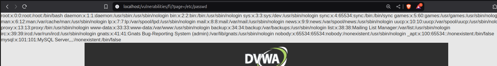

En este ejercicio, vamos a acceder a la siguiente ruta:

[Enlace](http://localhost/vulnerabilities/fi/?page=include.php)

Como podemos observar, en el enlace de este apartado, se realiza una operación GET para poder visualizar el estado del archivo (/?page=include.php). Si cambiamos el contenido situado después del "=", podremos visualizar el contenido de los archivos del servidor. Para testearlo, vamos a acceder a la siguiente ruta

    http://localhost/vulnerabilities/fi/?page=/etc/passwd

Y como podemos observar, estamos visualizando el contenido del archivo especificado:

