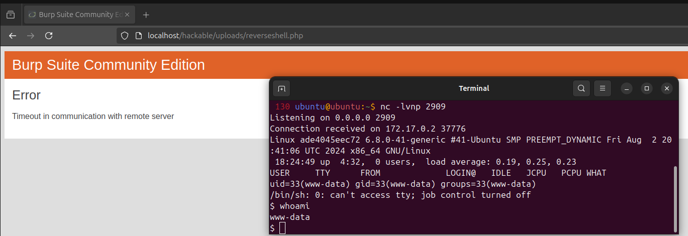

# 2.5-File Upload
En este apartado, vamos a realizar una reverse shell a nuestro equipo anfitrion tras realizar la subida de un archivo malicioso php a partir de la ventana de subida de archivos de la que disponemos. Para ello vamos a precisar acceder a la siguiente ruta:

## LOW
[Enlace](http://localhost/vulnerabilities/upload/)

Una vez dentro, procederemos a crear nuestro archivo malicioso. En este caso, el contenido del mismo es el indicado en el siguiente archivo:

[Archivo PHP](./assets/reverseshell.php)

Una vez creado, procederemos a realizar la inserción del mismo en nuestro servidor:

El siguiente paso va a ser abrir un puerto en nc para esperar la reverse shell:

    nc -lvnp 2909

Y si accedemos a la ruta del archivo malicioso, podemos comprobar que se queda cargando:

[Enlace](http://localhost/hackable/uploads/reverseshell.php)

Y si visualizamos nuestra máquina con nc activo, podemos observar que se ha realizado una reverse shell:

## MID

El proceso a realizar es el mismo, realizamos la subida del fichero pero antes de enviar la petición POST, la interceptamos con Burp Suite. Si observamos las cabeceras, vemos que se está enviando la información de que el archivo enviado es un fichero PHP en "Content-Type":

Es por ello que tras cambiar dicha cabecera a formato imagen y enviar el archivo, este se envia correctamente:

Y tras acceder al mismo desde la ruta facilitada, podemos obtener una reverse shell:

