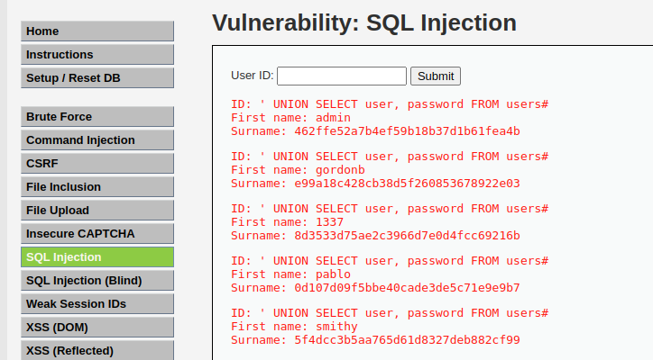
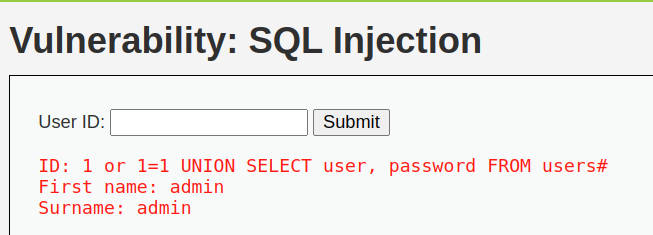

# 2.6-SQLi

A continuación, vamos a realizar un SQL Injection. Esto consiste en extraer información de la base de datos del servidor. Para realizar esta operación, hay muchos diferentes tipos de comandos que se pueden ejecutar, pero en nuestro caso vamos a implementar el siguiente:

    1 or 1=1 UNION SELECT user, password FROM users#

1 or 1=1

    Esta condición siempre será verdadera porque "1=1" es una verdad universal. Si este fragmento se usa en una consulta SQL mal protegida, podría forzar a que se devuelvan más registros de los esperados.

 UNION SELECT user, password FROM users

    El operador UNION se usa para combinar resultados de dos consultas. Si la consulta original está extrayendo datos de una tabla, esta parte intenta inyectar otra consulta que extraiga nombres de usuario y contraseñas desde la tabla users.

    => #
    
El # es un comentario en SQL hace que todo lo que viene después será ignorado por el motor SQL, lo que ayuda a evitar errores de sintaxis.

Dicho comando traducido, sería algo así:

    SELECT name, age FROM clients WHERE id = '1' or 1=1 
    UNION SELECT user, password FROM users

## LOW

Para hacer una prueba, vamos a acceder a la siguiente ruta de nuestro contenedor Docker:

[Enlace](http://localhost/vulnerabilities/sqli/)

Y una vez dentro, ejecutaremos el comando y podremos observar que nos ha extraido el nombre de usuario y el "surname" que viene a ser la contraseña en texto plano:

    ' UNION SELECT user, password FROM users#

## MID

En este caso, el proceso a seguir es el mismo, vamos a indicar el siguiente comando SQL para realizar la extraccón de las credenciales:

    1 or 1=1 UNION SELECT user, password FROM users#

Y como podemos observar, hemos podido realizar una SQL Injection

