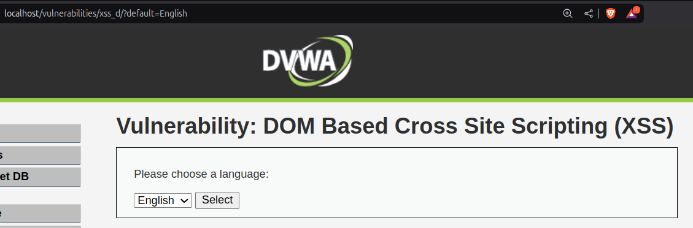
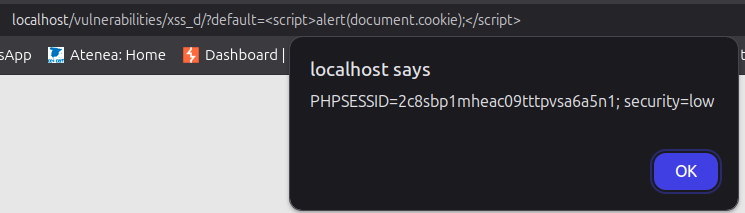
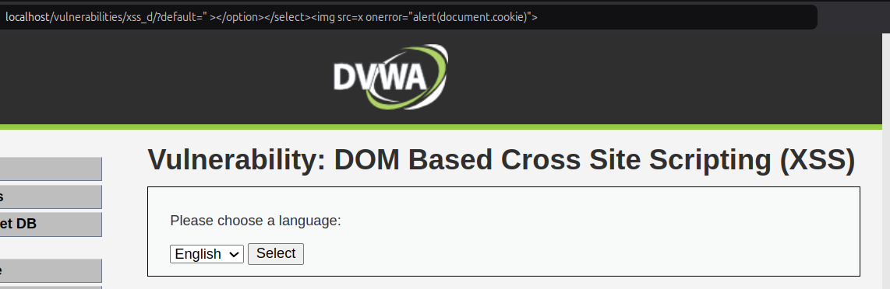
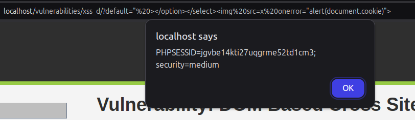

# 2.9-DOM XSS

En este apartado, se va a realizar la ejecución de al vulnerabilidad XSS para extraer la cookie de sesión. Esto es posible debido a que si accedemos a la ruta del apartado, se nos solicita seleccionar un idioma. Una vez seleccionado, podemos observar que la URL cambia a la ejecución del idioma seleccionado:

## LOW

Dicho esto, el siguiente paso a realizar va a ser cambiar el nombre del idioma por el escript para mostrar la cookie:

    

Y tras realizar dicho cambio, obtenemos dicha cookie:

## MID

Ahora, si cambiamos dicho comando por el siguiente, podemos observar que también podemos vulnerar el sistema:

    " ></option></select>

Este comando, indica que se va a mostrar una imagen cuyo source no existe. Como es el caso de que se de un error, hemos indicado que se ejecute una alerta con la información sobre la cookie de sesión:

Y tras realizar la ejecución del mismo, podemos observar que se nos aparece una alerta con la cookie:

