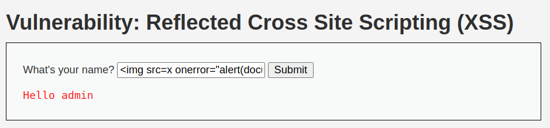
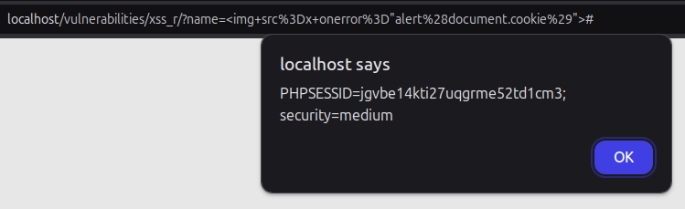

# 2.9.1-Reflected XSS

En este apartado, vamos a realizar otro XSS donde la finalidad va a ser la extracción de la cookie. La función que se realiza es muy similar a la anterior, compartiendo un enlace a una imagen inexistente y a partir del error, extraér dicha información.

## LOW y MID

Para ello vamos a indicar el siguiente payload:

    

Y tras realizar la ejecución del mismo, podemos observar que nos extrae la cookie

