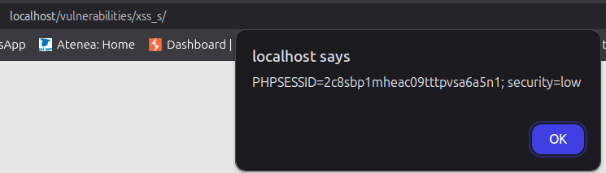

# 2.9.2-Stored XSS

En este apartado, vamos a realizar un XSS en un apartado de la web que nos permite crear mensajes en un foro como si fuera un chat. Al almacenarse dicho comentario hasta su eliminación, si la entrada no esta segurizada, podemos ejecutar un XSS en dicho foro y como se almacenará, este se ejecutará siempre que un usuario acceda a dicho foro. 

## LOW

Para este caso vamos a implemetar el siguiente comando que intenta cargar una imagen y, como dicha imagen no existe, al arrojar el error nos capturará la coockie del cliente que ha accedido:

    

Y tras acceder a la página desde otro usuario, vemos que se ejecuta el código:

## MID

El comando que vamos a ejecutar es es siguiente:

    

Y tras almacenarse en el chat y acceder al foro desde otro navegador con otro usuario, este codigo malicioso se va a ejecutar y obtendremos la siguiente alerta:

