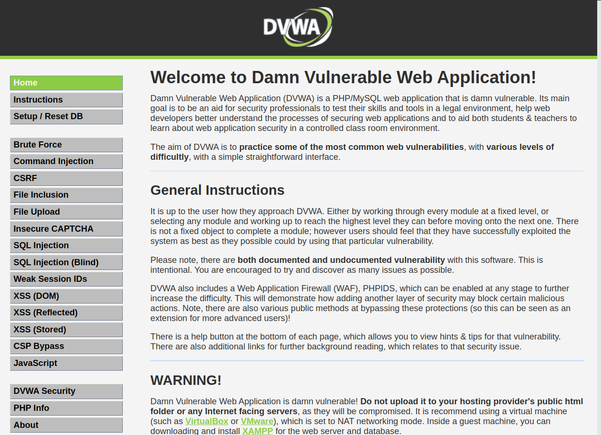

#RA3_2

En la realización de esta práctica, vamos a realizar una serie de test de penetración sobre nuestra maquina dvwa, que consta de una aplicación web vulnerable. Para proceder, vamos a realizar la descarga de la imagen de Docker con el siguiente comando:

    docker pull vulnerables/web-dvwa

Una vez realizada la descarga, procederemos a su ejecución con el siguiente comando:

    docker run -d --name dvwa -p 80:80 vulnerables/web-dvwa

Una vez ejecutada, podemos acceder a ella a través de nuestro navegador 

[http://localhost:80](http://localhost:80)

Se nos mostrará un login inicial donde las credenciales son:

    User: admin
    Pass: password

Una vez dentro, deberemos acceder al apartado inferior y pulsar sobre #Create/Reset Database para iniciar el proceso de creación de la base de datos que luego nos permitirá realizar las diferentes pruebas de vulnerabilidades:

    IMAGEN DATABASE

Una vez finalizado el proceso, obtendremos el siguiente resultado:

 
