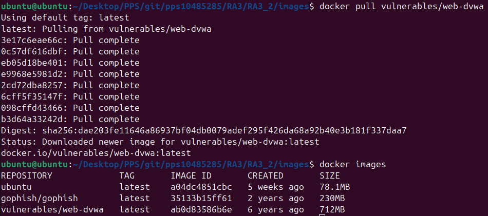

#RA3_2

En la realización de esta práctica, vamos a realizar una serie de test de penetración sobre nuestra maquina dvwa, que consta de una aplicación web vulnerable. Para proceder, vamos a realizar la descarga de la imagen de Docker con el siguiente comando:

    docker pull vulnerables/web-dvwa



Una vez realizada la descarga, procederemos a su ejecución con el siguiente comando:

    docker run -d --name dvwa -p 80:80 vulnerables/web-dvwa

Una vez ejecutada, podemos acceder a ella a través de nuestro navegador 

[http://localhost:80](http://localhost:80)

Se nos mostrará un login inicial donde las credenciales son:

    User: admin
    Pass: password

Una vez dentro, deberemos acceder al apartado inferior y pulsar sobre #Create/Reset Database para iniciar el proceso de creación de la base de datos que luego nos permitirá realizar las diferentes pruebas de vulnerabilidades:


Una vez finalizado el proceso, obtendremos el siguiente resultado:

 

La estructura del directorio de la práctica, es la siguiente:

```
├── 2.1-Brute_Force
│   ├── README.md
│   ├── coockie
│   └── images
│       ├── 2.1.1_cookie.png
│       └── 2.1.2_FinEjecucion.png
├── 2.10-CSP
│   ├── README.md
│   └── images
│       └── falloejecucion.png
├── 2.11-JS_Attacks
│   ├── README.md
│   └── images
│       ├── Phrase.png
│       ├── invalid.png
│       ├── success.png
│       ├── token1.png
│       └── token2.png
├── 2.2-Command_Injection
│   ├── README.md
│   └── images
│       ├── 2.2.1_Entrada.png
│       └── 2.2.2_Salida.png
├── 2.3-CSRF
│   ├── README.md
│   ├── images
│   │   ├── login.png
│   │   └── loginfail.png
│   └── source.html
├── 2.4-File_Inclusion
│   ├── README.md
│   └── images
│       └── 2.4.1_FI.png
├── 2.5-File_Upload
│   ├── README.md
│   ├── assets
│   │   └── reverseshell.php
│   └── images
│       ├── 2.5.1_FU.png
│       ├── 2.5.2_ReverseShell.png
│       └── 2.5.3_Loading.png
├── 2.6-SQLI
│   ├── README.md
│   └── images
│       └── 2.6.1_SQLI.png
├── 2.7-SQLI_Blind
│   ├── README.md
│   ├── assets
│   │   └── sqlVersion.py
│   └── images
│       └── dbVersion.png
├── 2.8-Weak_ID_Session
│   ├── README.md
│   └── images
│       ├── 2.8.1_Cookie1.png
│       └── 2.8.2_Cookie2.png
├── 2.9-DOM_XSS
│   ├── README.md
│   └── images
│       ├── 2.9.1_Vuln.png
│       ├── 2.9.2_XSS.png
│       └── 2.9.3_Cookie.png
├── 2.9.1-Reflected_XSS
│   ├── README.md
│   └── images
│       ├── Payload.png
│       └── XSS.png
├── 2.9.2-Stored_XSS
│   ├── README.md
│   └── images
│       ├── AccesoUsuario2.png
│       └── Script.png
├── README.md
└── images
    ├── 2.0_AccesoWeb.png
    ├── 2.0_Database.png
    └── 2.0_DownloadDockerImage.png
```
