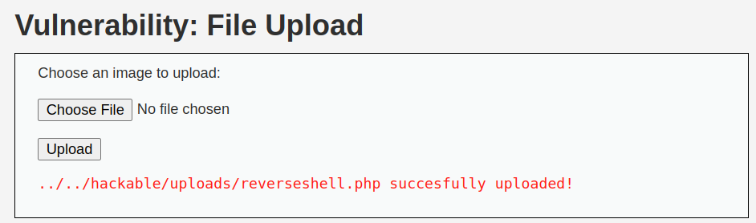
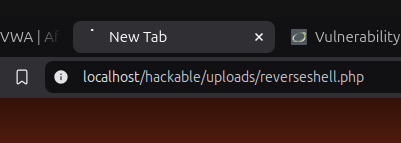
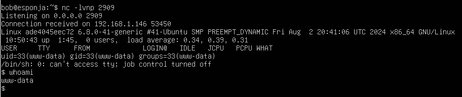

En este apartado, vamos a realizar una reverse shell a nuestro equipo anfitrion tras realizar la subida de un archivo malicioso php a partir de la ventana de subida de archivos de la que disponemos. Para ello vamos a precisar acceder a la siguiente ruta:

[Enlace](http://localhost/vulnerabilities/upload/)

Una vez dentro, procederemos a crear nuestro archivo malicioso. En este caso, el contenido del mismo es el indicado en el siguiente archivo:

[Archivo PHP](./assets/reverseshell.php)

Una vez creado, procederemos a realizar la inserción del mismo en nuestro servidor:

El siguiente paso va a ser abrir un puerto en nc para esperar la reverse shell:

    nc -lvnp 2909

Y si accedemos a la ruta del archivo malicioso, podemos comprobar que se queda cargando:

[Enlace](http://localhost/hackable/uploads/reverseshell.php)

Y si visualizamos nuestra máquina con nc activo, podemos observar que se ha realizado una reverse shell:

