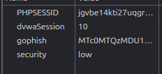
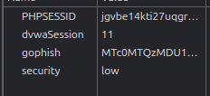

En este apartado, podemos observar que nos indica que se genera una cookie llamada dvwaSession cada vez que el boton Generate es pulsado. Si accedemos a la visualización de cookies tras pulsar el button, podemos observar que tenemos un valor en la cookie:

Y si pulsamos de nuevo sobre Generate, observamos que el valor de este aumenta en uno, no se genera uno nuevo:

