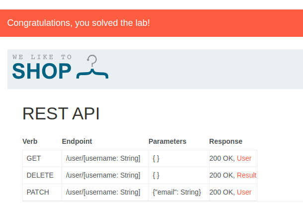
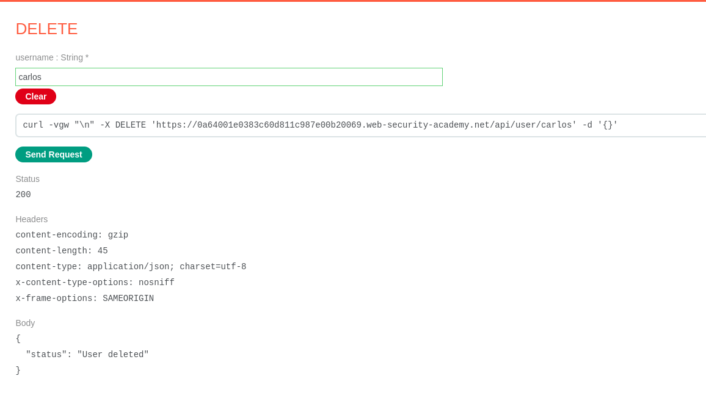

En este primer apartado, vamos a realizar la eliminación de una cuenta de un usuario. Segun la documentación de PortSwing, las API suelen ser públicas es por ello que si accedemos a la ruta /api podemos encontrar la siguiente documentación respecto a las funciones que podemos ejecutar de manera interactiva:

 

La finalizadad de esta práctica es eliminar el usuario Carlos, es por ello que tras pulsar en "Delete" e indicar el nombre Carlos, podemos observar que dicho usuario ha sido eliminado y el laboratorio finalizado:

