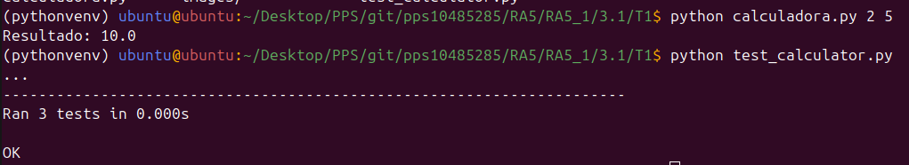
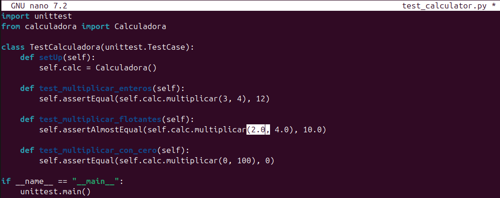
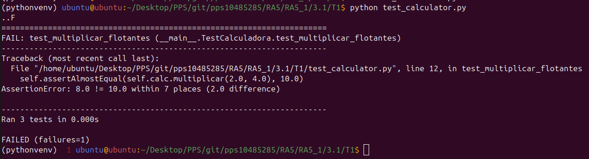

# 🧮 Calculadora de Multiplicación en Python

Este proyecto es una práctica inicial para preparar un entorno de integración continua con Jenkins. Consiste en una pequeña aplicación en Python que realiza la multiplicación de dos números pasados como argumentos desde la línea de comandos, junto con pruebas unitarias utilizando `unittest`.

---

## 📂 Estructura del Proyecto

```
T1/
├── README.md			# Este archivo de documentación
├── calculadora.py		# Script principal para multiplicar dos números
└── test_calculator.py		# Pruebas unitarias de la clase Calculadora
```

---

## 🚀 Cómo ejecutar

### Multiplicación desde línea de comandos

```bash
python calculadora.py 3 5
```

**Salida esperada:**

```
Resultado: 15.0
```

---

### ✅ Ejecutar pruebas unitarias

```bash
python test_calculator.py
```

**Ejemplo de salida:**

```
...
----------------------------------------------------------------------
Ran 3 tests in 0.001s

OK
```

---

## 🧪 Descripción técnica

### `calculadora.py`

- Contiene la clase `Calculadora` con un método `multiplicar(a, b)`.
- Valida los argumentos de entrada y muestra el resultado por consola.

### `test_calculator.py`

- Utiliza el módulo `unittest` para probar el método `multiplicar`.
- Contiene pruebas para:
  - Multiplicación de enteros
  - Multiplicación de flotantes
  - Multiplicación con cero

---

## 📌 Requisitos

- Python 3.x
- (Opcional) Un entorno virtual para mantener las dependencias controladas

---

## 📦 Próximos pasos

En siguientes tareas se integrará este proyecto con Jenkins para:

- Ejecutar pruebas automáticamente en cada push
- Generar reportes de prueba
- Automatizar el despliegue (CI/CD)

---

# PRUEBAS DE EJECUCIÓN

## Calculadora y Test funcionan



## Cambio en el test para verficar acciones ante fallos



## Test fallo 


