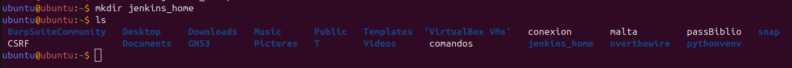
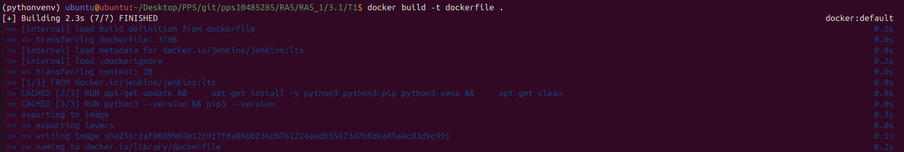
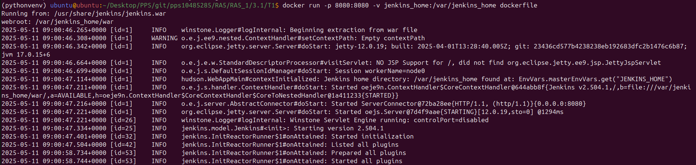
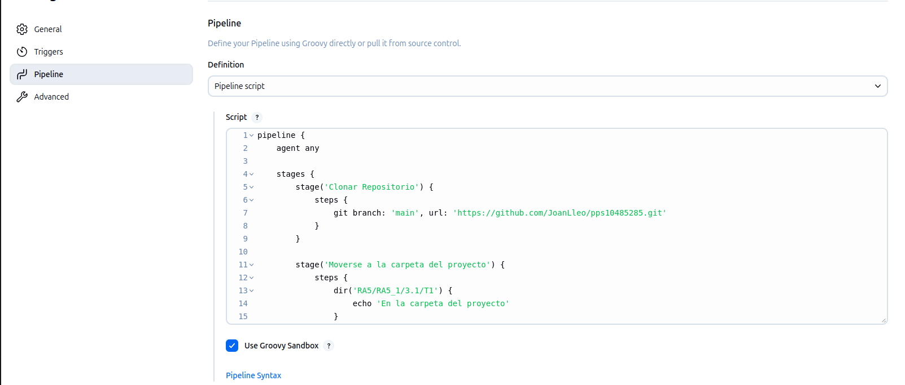
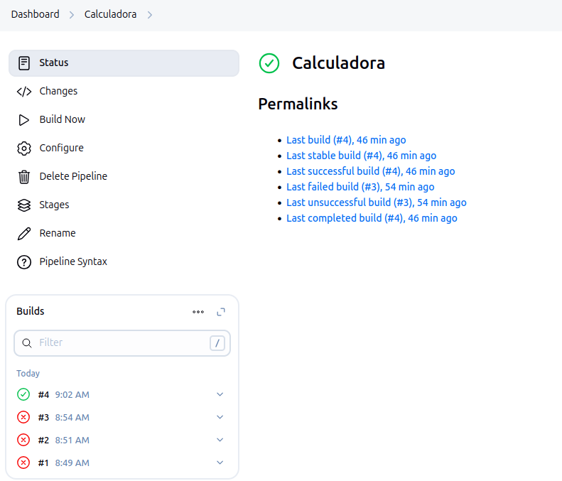
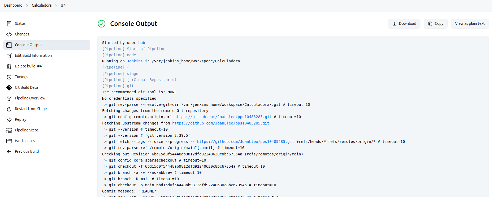
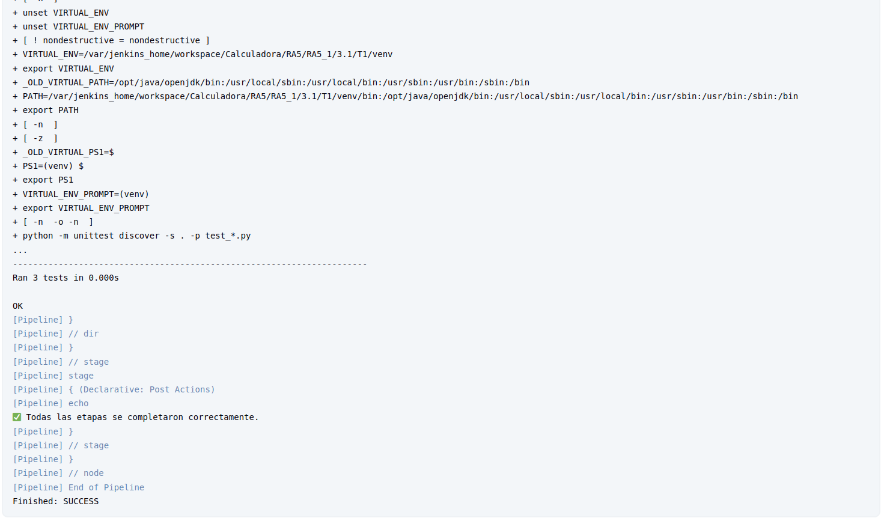
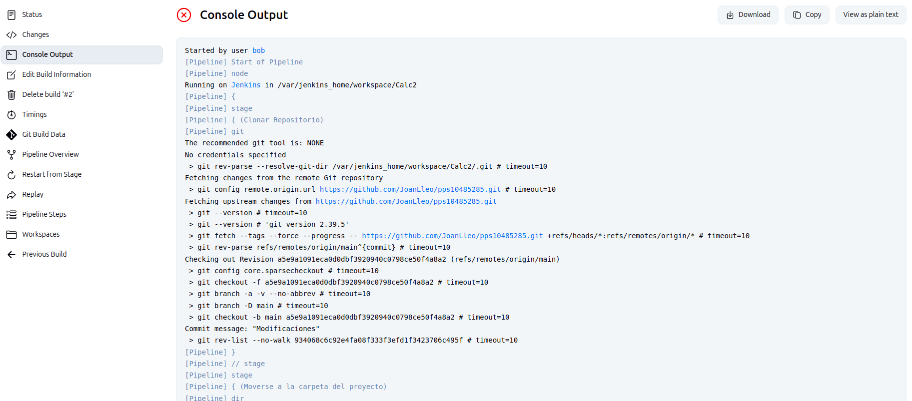
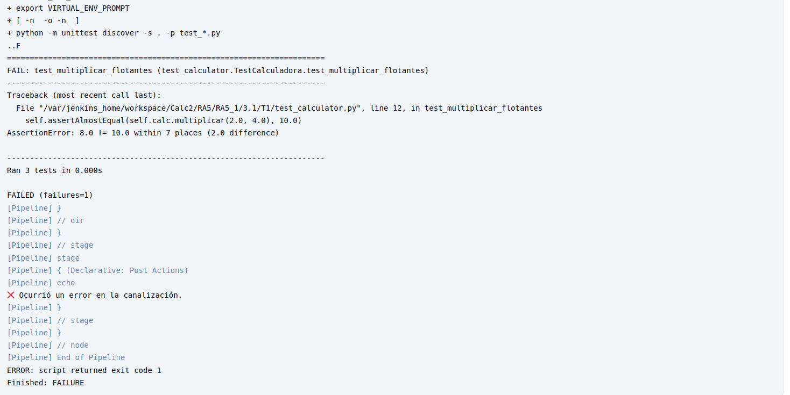

# Instalación de Jenkins en Docker

Este documento describe cómo instalar y configurar Jenkins en un contenedor Docker de manera sencilla.

## Prerrequisitos

- **Docker** instalado en tu máquina. Verifica con:
  ```bash
  docker --version
  ```
  Si no lo tienes, descárgalo desde [Docker Official Site](https://docs.docker.com/get-docker/).

## Pasos de Instalación

### 1. Crea un directorio para persistir datos
Crea un directorio en tu máquina para almacenar las configuraciones y datos de Jenkins:
```bash
mkdir ~/jenkins_home
```



### 2. Ejecución del Dockerfile 
Nos creamos una imagen con Jenkins y el entorno virtual de python instalados

```bash
docker build -t dockerfile .
```



### 3. Ejecuta el contenedor de Jenkins
Inicia un contenedor Docker con Jenkins usando el siguiente comando:
```bash
docker run -p 8080:8080  -v ~/jenkins_home:/var/jenkins_home dockerfile
```



**Explicación de los parámetros:**
- `-p 8080:8080`: Mapea el puerto 8080 del host al puerto 8080 del contenedor (interfaz web de Jenkins).
- `-v ~/jenkins_home:/var/jenkins_home`: Monta el directorio local `~/jenkins_home` para persistir datos.
- `dockerfile`: Usa la imagen LTS de Jenkins.

### 5. Accede a Jenkins
Abre un navegador y navega a:
```
http://localhost:8080
```
La primera vez, Jenkins te pedirá una contraseña inicial.

### 6. Obtén la contraseña inicial
Recupera la contraseña inicial ejecutando:
```bash
docker exec jenkins cat /var/jenkins_home/secrets/initialAdminPassword
```
Copia la contraseña y pégala en la interfaz web.

## Notas Adicionales

- **Persistencia**: El directorio `~/jenkins_home` asegura que las configuraciones se mantengan aunque el contenedor se detenga o elimine.

## Solución de Problemas

Si encuentras problemas, revisa los logs del contenedor con:
```bash
docker logs jenkins
```

Para más ayuda, consulta la [documentación oficial de Jenkins](https://www.jenkins.io/doc/) o la [página de la imagen en Docker Hub](https://hub.docker.com/r/jenkins/jenkins).


# Comprobaciones funcionamiento Jenkins

Una vez tengamos la pipeline creada, le hemos indicado el siguiente Jenkinsfile para que cree un entorno virtual de Python y pueda ejecutar los test del repositorio:

```Jenkins
pipeline {
    agent any

    stages {
        stage('Clonar Repositorio') {
            steps {
                git branch: 'main', url: 'https://github.com/JoanLleo/pps10485285.git'
            }
        }

        stage('Moverse a la carpeta del proyecto') {
            steps {
                dir('RA5/RA5_1/3.1/T1') {
                    echo 'En la carpeta del proyecto'
                }
            }
        }

        stage('Instalar Dependencias') {
            steps {
                dir('RA5/RA5_1/3.1/T1') {
                    sh 'python3 -m venv venv && . venv/bin/activate && pip install --upgrade pip'
                }
            }
        }

        stage('Ejecutar Pruebas') {
            steps {
                dir('RA5/RA5_1/3.1/T1') {
                    sh '. venv/bin/activate && python -m unittest discover -s . -p "test_*.py"'
                }
            }
        }
    }

    post {
        success {
            echo '✅ Todas las etapas se completaron correctamente.'
        }
        failure {
            echo '❌ Ocurrió un error en la canalización.'
        }
    }
}
```



Y tras ejecutarlo, podemos observar que se ha realizado la ejecución de los test de manera satisfactoria:



Si observamos los logs del terminal, podemos observar todas las acciones realizadas:





Y si realizamos un cambio en el test, podemos observar que nos arroja el error dentro del mismo:





