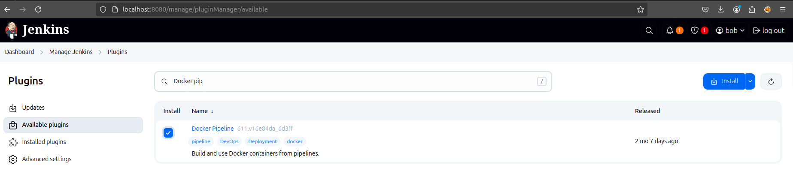
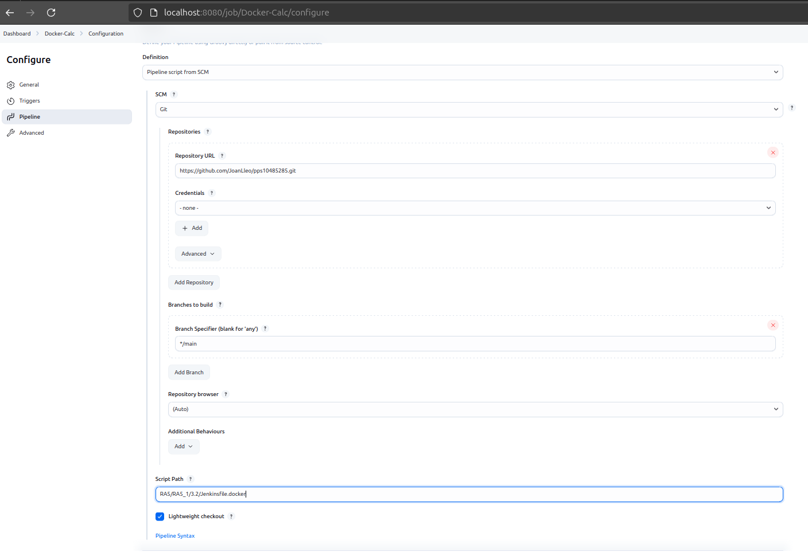
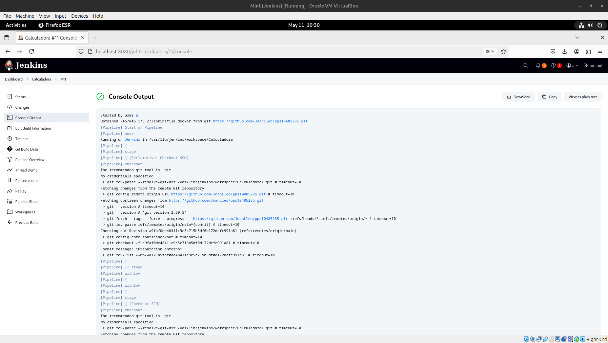

# Proyecto Jenkins Pipeline Docker

Este proyecto configura un pipeline en Jenkins para automatizar la construcción y prueba de una aplicación Python dentro de un contenedor Docker.

## Descripción

Este pipeline está diseñado para:
1. **Clonar** el código fuente desde un repositorio Git.
2. **Construir una imagen Docker** utilizando un `Dockerfile`.
3. **Ejecutar un contenedor Docker** basado en la imagen construida.
4. **Ejecutar pruebas unitarias** dentro del contenedor utilizando el framework `unittest` de Python.
5. **Limpiar los recursos Docker** eliminando los contenedores y liberando espacio de almacenamiento al final de la ejecución.

## Estructura del Proyecto

El proyecto contiene los siguientes archivos relevantes:

- `RA5/RA5_1/3.2/Dockerfile`: El archivo Dockerfile utilizado para crear la imagen Docker.
- `RA5/RA5_1/3.2/docker-compose.yml`: Archivo de configuración para Docker Compose (aunque no se usa directamente en este pipeline).
- `RA5/RA5_1/3.2/calculadora.py`: El código de la aplicación Python.
- `RA5/RA5_1/3.2/test_calculator.py`: Pruebas unitarias para la aplicación Python.
- `RA5/RA5_1/3.2/Jenkinsfile.docker`: El archivo del pipeline que define las etapas de ejecución en Jenkins.

## Flujo del Pipeline

El flujo de ejecución del pipeline es el siguiente:

1. **Checkout del código fuente**:
   - Se clona el repositorio desde GitHub utilizando el archivo `Jenkinsfile.docker`.
   - El código es extraído de la rama principal (`main`).

2. **Creación de la imagen Docker**:
   - Se utiliza el archivo `Dockerfile` ubicado en `RA5/RA5_1/3.2` para construir la imagen.
   - El comando Docker ejecutado es:
     ```bash
     docker build -t my-jenkins-pps10485285:latest -f RA5/RA5_1/3.2/Dockerfile .
     ```

3. **Ejecución del contenedor Docker**:
   - El contenedor es creado y ejecutado en segundo plano.
   - El volumen del contenedor está montado en el directorio `RA5/RA5_1/3.2` para acceder a los archivos de la aplicación y las pruebas.
   - El comando ejecutado es:
     ```bash
     docker run -d --name test-jenkins-container -v /var/lib/jenkins/workspace/Calculadora/RA5/RA5_1/3.2:/app my-jenkins-pps10485285:latest sleep infinity
     ```

4. **Ejecución de pruebas**:
   - Se ejecutan las pruebas unitarias utilizando `unittest` dentro del contenedor Docker.
   - El comando ejecutado dentro del contenedor es:
     ```bash
     python3 -m unittest test_calculator.py
     ```
   - Si las pruebas son exitosas, el pipeline continúa.

5. **Limpieza de recursos**:
   - El contenedor es detenido y eliminado después de la ejecución.
   - Se ejecuta un comando para limpiar imágenes y contenedores no utilizados en Docker:
     ```bash
     docker system prune -f
     ```

## Requerimientos

- **Jenkins**: Para la ejecución del pipeline.
- **Docker**: Para la creación de imágenes y ejecución de contenedores.
- **Python 3.10**: Para ejecutar la aplicación y las pruebas.
- **Git**: Para clonar el repositorio de código.

## Archivos Relevantes

- `Dockerfile`: Define cómo construir la imagen Docker para ejecutar la aplicación Python.
- `Jenkinsfile.docker`: Define las etapas del pipeline de Jenkins.
- `test_calculator.py`: Contiene las pruebas unitarias de la aplicación Python.
- `calculadora.py`: Contiene la implementación de la calculadora en Python.

## Configuración de Jenkins

1. **Docker Pipeline**:

Instalamos el módulo de Jenkins para implementar contenedores en pipelines



2. **Configuración Jenkins**:

Configuramos la pipeline de Jenkins para la ejecución de procesos:



3. **Resultados**:

Una vez finalizado el proceso, podemos verificar que se ha ejecutado correctamente:



Si queremos ver el registro entero, se puede visualizar en el siguiente [enlace](./assets/AutomaticoJenkins.txt)
