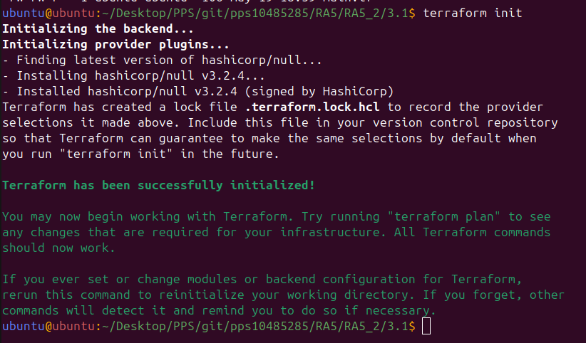
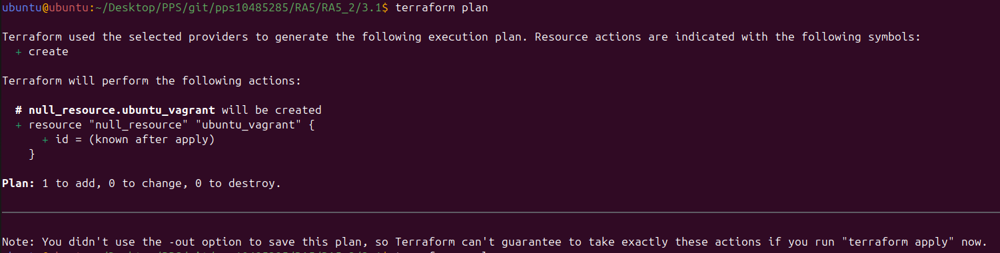
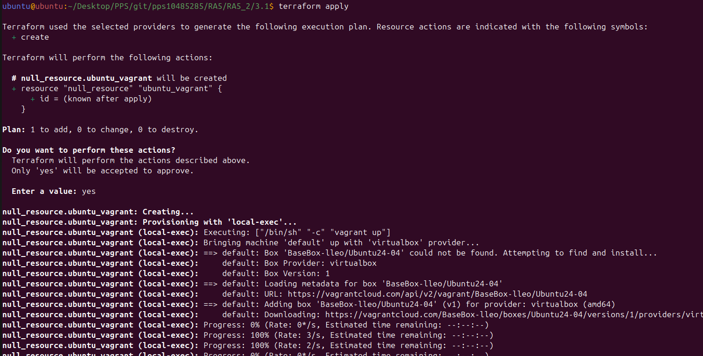
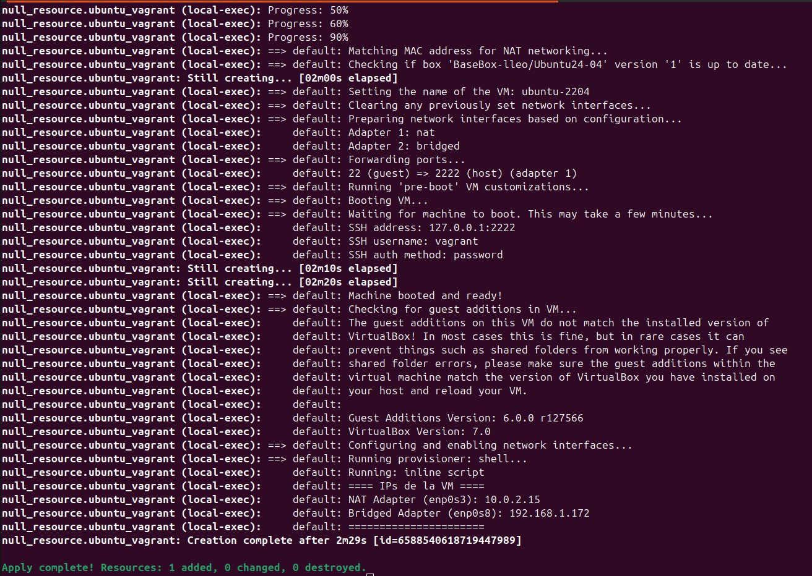

# Práctica 3.1: Provisionamiento de una máquina virtual Ubuntu 24.04 con Terraform

Este ejercicio consiste en provisionar una máquina virtual con Ubuntu 24.04 utilizando **Terraform** y **VirtualBox**, partiendo de una imagen `.box` personalizada que ha sido previamente empaquetada y subida a **Vagrant Cloud**.

## Objetivo

- Crear una VM Ubuntu 24.04 en VirtualBox mediante Terraform.
- Utilizar una imagen propia en formato `.box` publicada en Vagrant Cloud como base para la VM.
- Automatizar completamente la creación de la infraestructura virtual.

## Requisitos

Antes de ejecutar este proyecto, asegúrate de tener instaladas las siguientes herramientas:

- [Terraform](https://developer.hashicorp.com/terraform)
- [Vagrant](https://www.vagrantup.com/)
- [VirtualBox](https://www.virtualbox.org/)
- Acceso a Vagrant Cloud para descargar la box publicada.

## Estructura del directorio

```
.
├── README.md
├── Vagrantfile
├── images
│   ├── 1 - CuentaCreada.png
│   ├── 2 - EmpaquetadoDeVMPersonalizada.png
│   ├── 3 - SubidaBoxAVagrantPrivada.png
│   ├── MaquinaIniciada.png
│   ├── apply.png
│   ├── init.png
│   └── plan.png
└── main.tf
```

## Descripción técnica

El archivo `main.tf` define un proveedor de Vagrant para VirtualBox que utiliza como base una imagen `.box` personalizada alojada en Vagrant Cloud. Terraform se encarga de la descarga de la box (si es necesario), así como de la creación y configuración de la máquina virtual.

1. Creación de cuenta


2. Compresión de archivos


3. Subida de .box 


## Cómo usar este proyecto

1. Clona el repositorio o navega al directorio del ejercicio:

   ```bash
   git clone https://github.com/JoanLleo/pps10485285.git
   cd pps10485285/RA5/RA5_2/3.1
   ```

2. Inicializa Terraform:

   ```bash
   terraform init
   ```



3. (Opcional) Revisa o modifica el archivo `variables.tf` según tus preferencias.

4. Ejecuta el plan para revisar las acciones:

   ```bash
   terraform plan
   ```



5. Aplica el plan para crear la máquina virtual:

   ```bash
   terraform apply
   ```



6. Acceso a la VM.



7. Cuando hayas terminado, puedes destruir la VM con:

   ```bash
   terraform destroy
   ```

