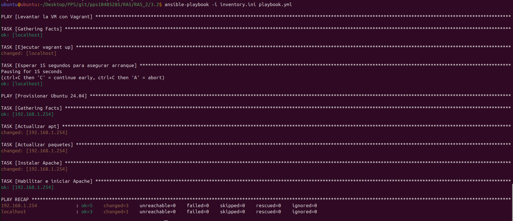
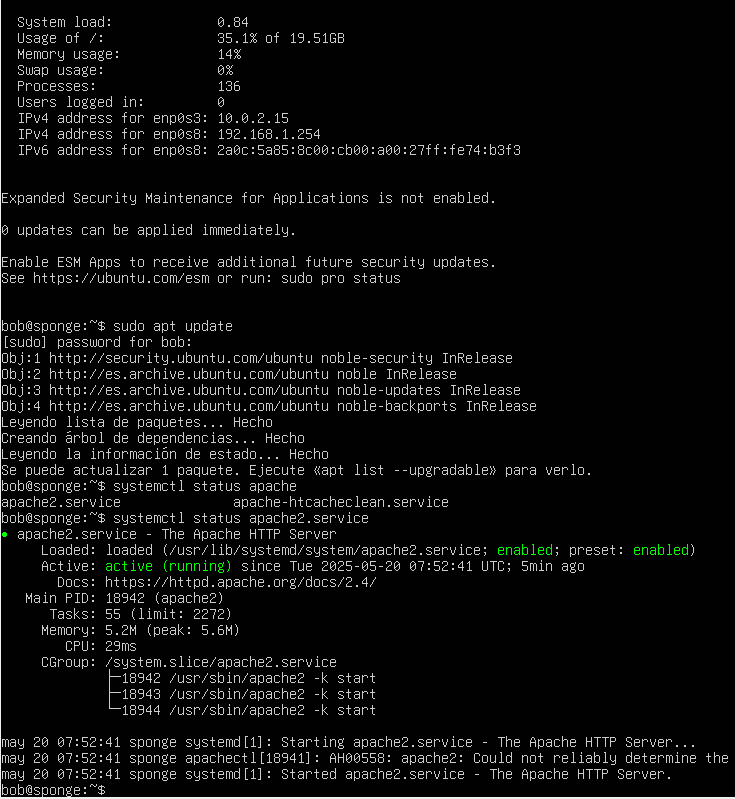
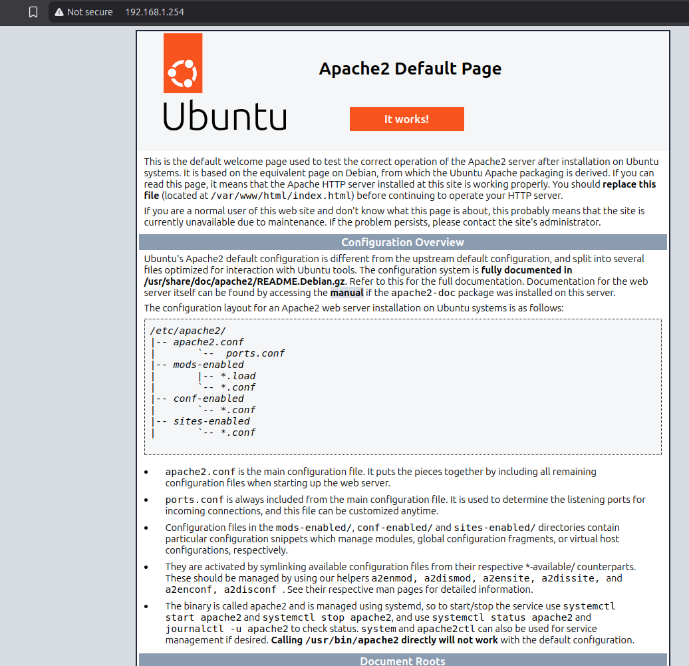

# Automatización de VM Ubuntu Server 24.04 con Vagrant, VirtualBox y Ansible

Este proyecto permite:

- Levantar una máquina virtual Ubuntu 24.04 en VirtualBox mediante **Vagrant**.
- Asignarle una IP **fija** en modo **bridge** (`192.168.1.254`).
- Automatizar su configuración mediante **Ansible**, incluyendo:
  - `apt update` y `upgrade`
  - Instalación del servidor **Apache2**

---

## 📁 Estructura del proyecto

```
.
├── README.md
├── Vagrantfile         # Define la VM Ubuntu con IP fija 
├── images
│   ├── AccesoWeb.png
│   ├── EjecuciónAnsible.png
│   └── Upgrade y Apache.png
├── inventory.ini       # Inventario estático con la IP fija de la VM
└── playbook.yml        # Playbook Ansible para configuración de la VM 
```

---

## 📦 Requisitos

- [VirtualBox](https://www.virtualbox.org/)
- [Vagrant](https://www.vagrantup.com/)
- [Ansible](https://www.ansible.com/)
- `sshpass` (requerido si usas autenticación por contraseña)

### Instalación de sshpass en Ubuntu/Debian

```bash
sudo apt update
sudo apt install sshpass
```

---

## 🚀 Cómo usar

1. Clona el repositorio:

```bash
git clone https://github.com/JoanLleo/pps10485285.git
cd pps10485285/RA5/RA5_2/3.2/
```

2. Ejecuta el playbook de Ansible (esto levanta la VM y la configura):

```bash
ansible-playbook -i inventory.ini playbook.yml
```





3. Una vez finalizado, abre tu navegador y visita:

```
http://192.168.1.254
```



Deberías ver la página de bienvenida de Apache.

---

## 🛠️ Personalización

- Puedes cambiar la IP fija modificando esta línea en el `Vagrantfile`:

```ruby
config.vm.network "public_network", bridge: "enp5s0", ip: "192.168.1.254"
```

- Asegúrate de que esa IP esté disponible en tu red local.

---

## 📌 Notas

- Este proyecto usa autenticación por **usuario/contraseña** (`vagrant/vagrant`) para Ansible.
- Si prefieres usar **clave privada**, puedes configurar Ansible con el archivo `.vagrant/machines/default/virtualbox/private_key`.

---

## 📄 Licencia

Este proyecto está bajo la licencia MIT.
