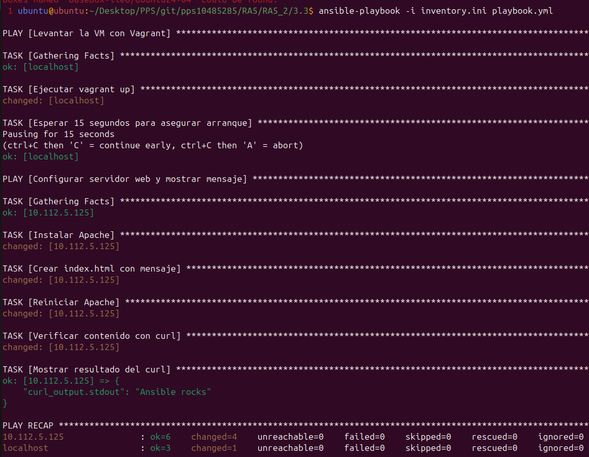
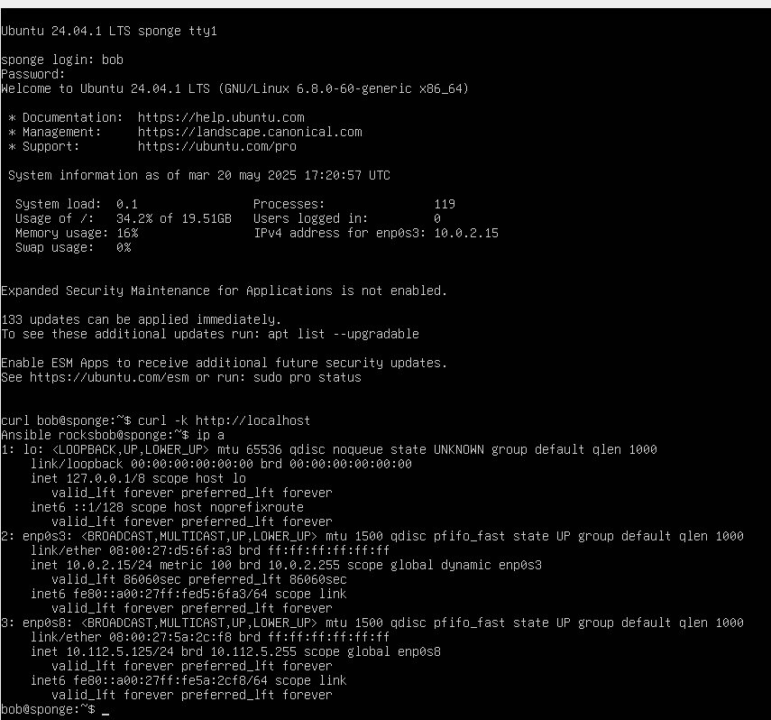
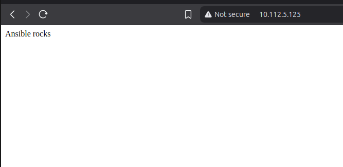

# Práctica 3.3 - Provisión de Ubuntu 24.04 con Ansible y Vagrant

## Objetivo

Configurar una máquina virtual Ubuntu 24.04 en VirtualBox usando Vagrant y provisionarla mediante Ansible para:

- Instalar el servidor web Apache.
- Crear un archivo `index.html` con el contenido `Ansible rocks`.
- Reiniciar el servicio web.
- Verificar la respuesta del servidor mediante `curl`.

---

## Requisitos

- Vagrant
- VirtualBox
- Ansible
- Una conexión de red bridge disponible

---

## Estructura del proyecto

```
.
├── README.md
├── Vagrantfile
├── images
│   ├── Ejecucion.png
│   ├── Resultado.png
│   └── Terminal.png
├── inventory.ini
└── playbook.yml
```

---

## Contenido de los archivos

### `Vagrantfile`

```ruby
Vagrant.configure("2") do |config|
  config.vm.box = "BaseBox-lleo/Ubuntu24-04"
  config.vm.box_version = "1"

  config.vm.provider "virtualbox" do |vb|
    vb.name = "ubuntu-2404"
    vb.memory = 2048
    vb.cpus = 2
    vb.gui = false
  end

  config.ssh.username = "vagrant"
  config.ssh.password = "vagrant"
  config.ssh.insert_key = false

  config.vm.synced_folder ".", "/vagrant", disabled: true

  # Red en modo bridge con IP fija (modificar según red disponible)
  config.vm.network "public_network", ip: "192.168.1.100"

  # Instalar Python para Ansible
  config.vm.provision "shell", inline: <<-SHELL
    sudo apt update -y
    sudo apt install -y python3
  SHELL
end
```

---

### `inventory.ini`

```ini
[ubuntu_vm]
192.168.1.100 ansible_user=vagrant ansible_password=vagrant ansible_connection=ssh ansible_ssh_common_args='-o StrictHostKeyChecking=no'
```

---

### `playbook.yml`

```yaml
---
- name: Provisionar Ubuntu 24.04
  hosts: ubuntu_vm
  become: yes
  tasks:
    - name: Instalar Apache
      apt:
        name: apache2
        state: present
        update_cache: yes

    - name: Crear index.html con mensaje
      copy:
        content: "Ansible rocks"
        dest: /var/www/html/index.html

    - name: Reiniciar Apache
      service:
        name: apache2
        state: restarted

    - name: Verificar contenido con curl
      command: curl http://localhost
      register: curl_output

    - name: Mostrar resultado del curl
      debug:
        var: curl_output.stdout
```

---

## Instrucciones de uso

1. Ejecuta el playbook de Ansible:

```bash
ansible-playbook -i inventory.ini playbook.yml
```



2. Verifica que la salida incluya:

```yaml
"curl_output.stdout": "Ansible rocks"
```




3. Verificar desde el navegador.



---

