# Parte 3.1 - Instalación y configuración de Grafana y Prometheus con Docker

Este README documenta el proceso seguido para configurar un stack de monitorización local utilizando Docker Compose, Prometheus, Grafana, Traefik y otros servicios.

## Componentes del stack

- **Prometheus**: Recolección de métricas.
- **Grafana**: Visualización de métricas.
- **Node Exporter**: Exportación de métricas del sistema host.
- **Traefik**: Reverse proxy para exponer servicios web y métricas a Prometheus.
- **cAdvisor**: Métricas de contenedores Docker.

## Estructura del proyecto

```
.
├── README.md
├── images
│   ├── 0.png
│   ├── 1.png
│   ├── 10.png
│   ├── 11.png
│   ├── 12.png
│   ├── 13.png
│   ├── 2.png
│   ├── 3.png
│   ├── 4.png
│   ├── 5.png
│   ├── 6.png
│   ├── 7.png
│   ├── 8.png
│   └── 9.png
└── prometheus_grafana_example
    ├── Dockerfile
    ├── Readme.md
    ├── cloudformation template
    │   └── single_server_EC2_application.yml
    ├── diagram
    │   ├── flow_chart
    │   └── prometheus sources
    ├── docker-compose.yml
    ├── grafana
    │   └── datasources
    │       └── datasource.yml
    ├── index.js
    ├── node_modules
    ├── package.json
    ├── prometheus
    │   └── prometheus.yml
    └── traefik.yml
```

## Pasos realizados

### 1. Modificación del archivo prometheus.yml

Se modifica el archivo de configuración de Prometheus para evitar problemas con la versión de recopilación de datos:

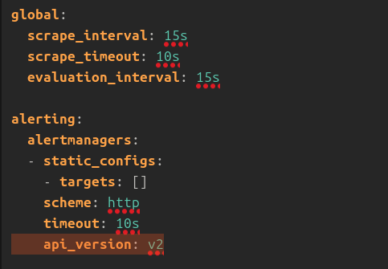

### 2. Construcción de imagenes docker

El siguiente paso es construir las imágenes de Docker definidas en el archivo docker-compose.yml

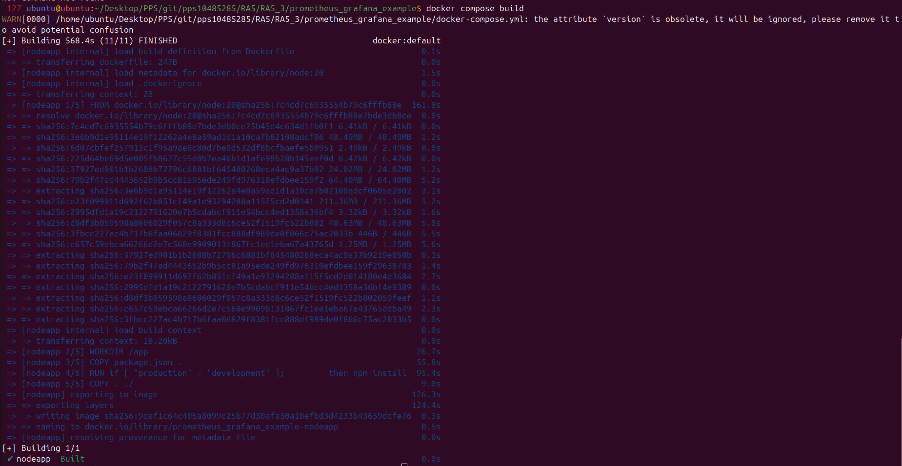

### 3. Ejecución de contenedores

Iniciamos los contenedores definidos en el archivo docker-compose.yml

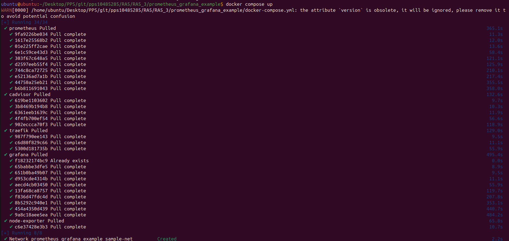

### 4. Validación

- Verificación de métricas en Prometheus: `http://localhost:9090`

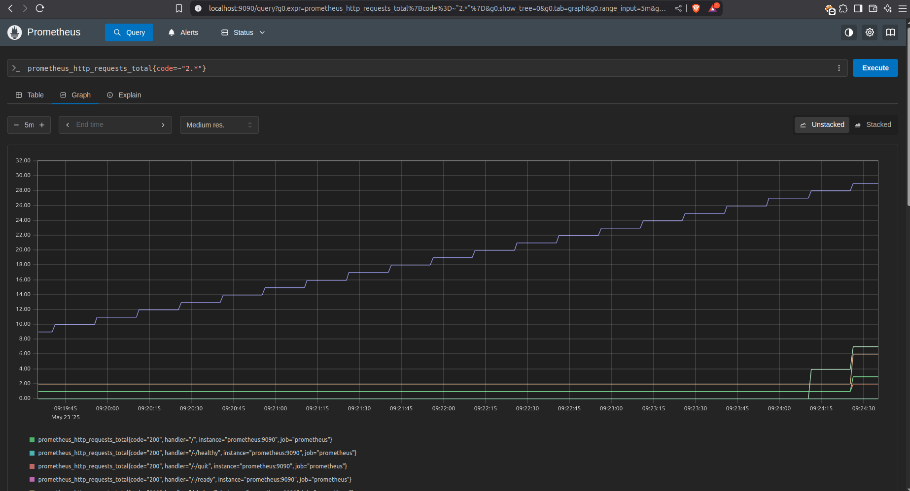

- Visualización de datos en Grafana: `http://localhost:3000`

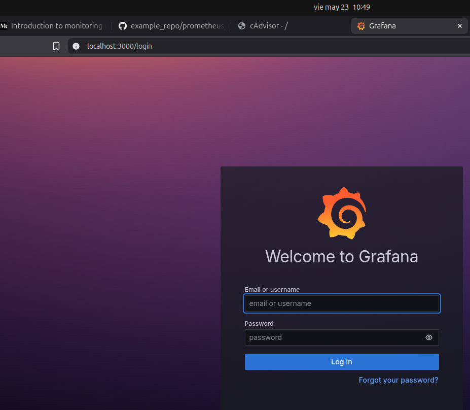

- Visualización de datos en cAdvisor

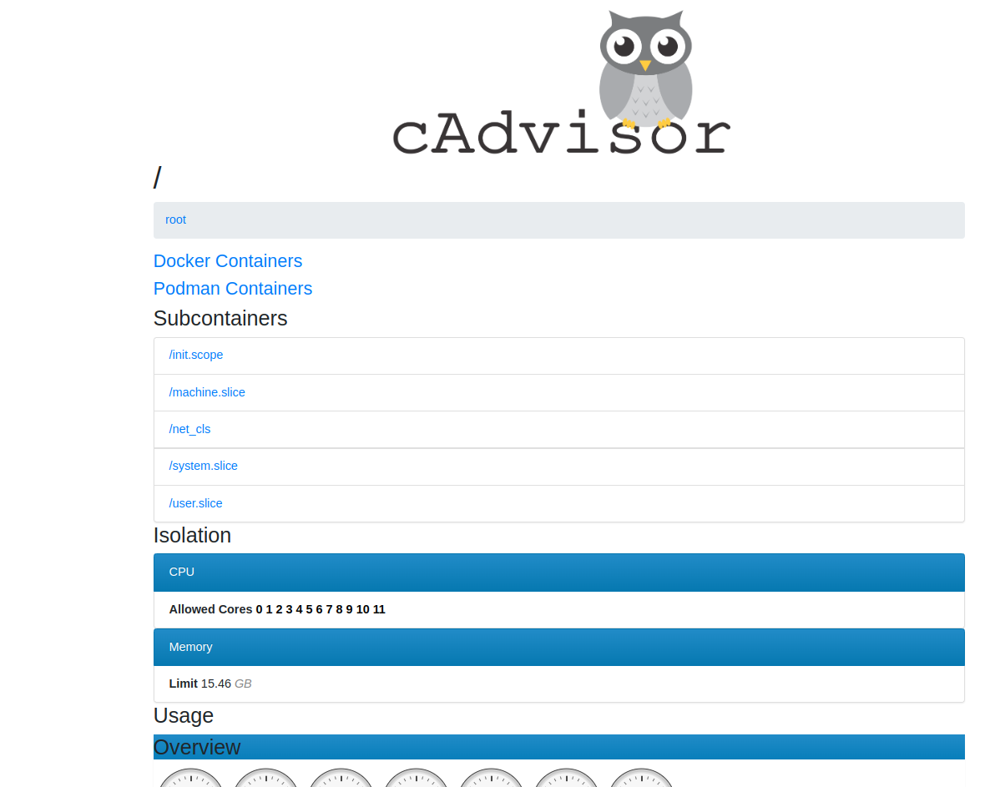
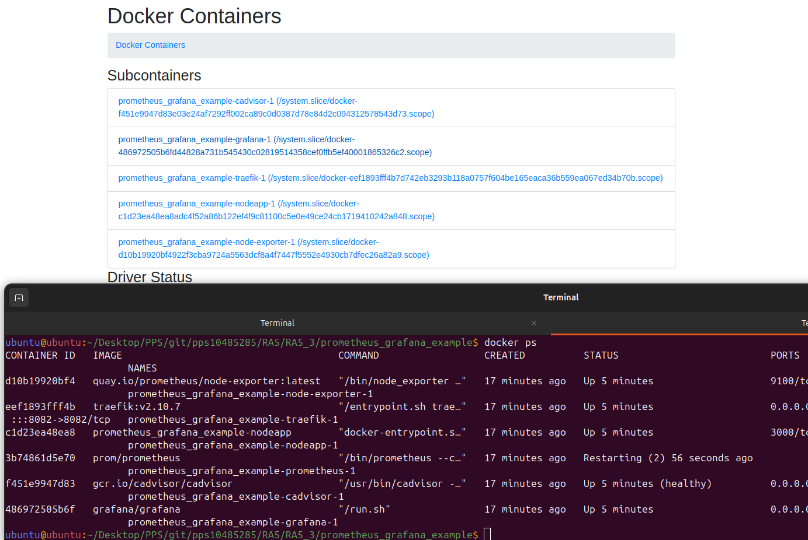
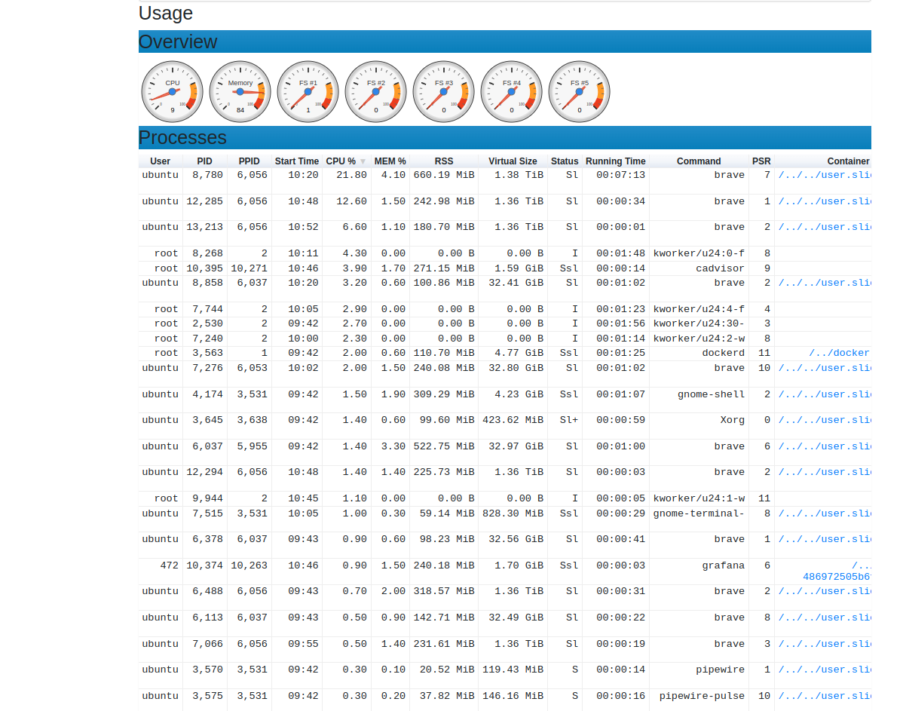
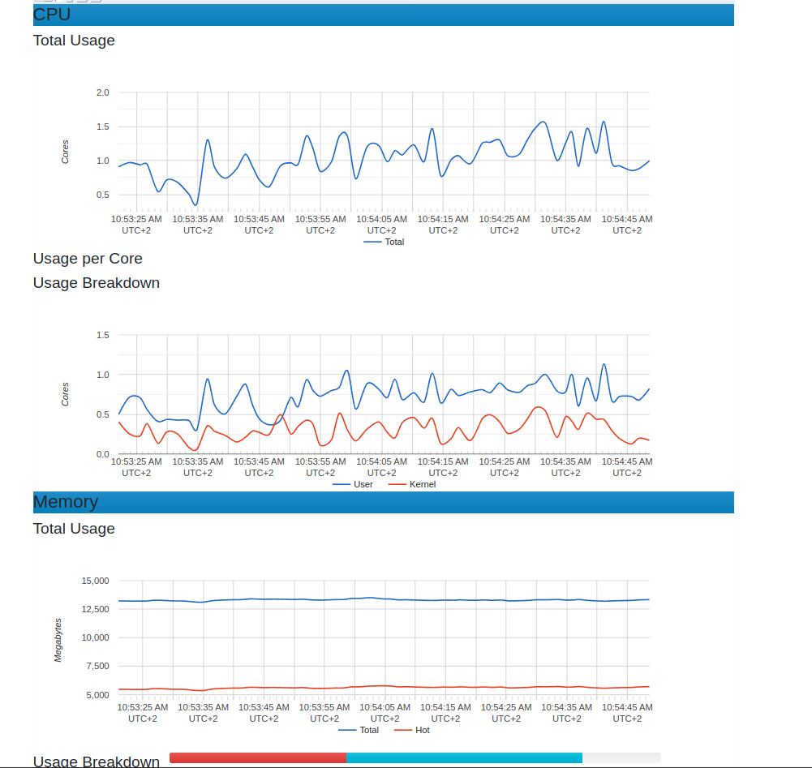

### 5. Grafana

- Acceso al dashboard de Grafana

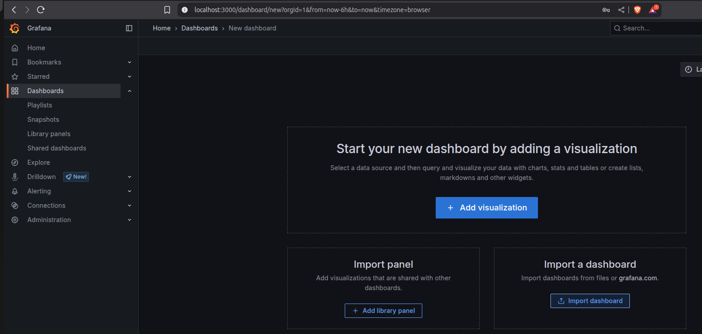

- Visualización del dashboard a implementar y localización del ID 1860 para la implementación en el servidor local

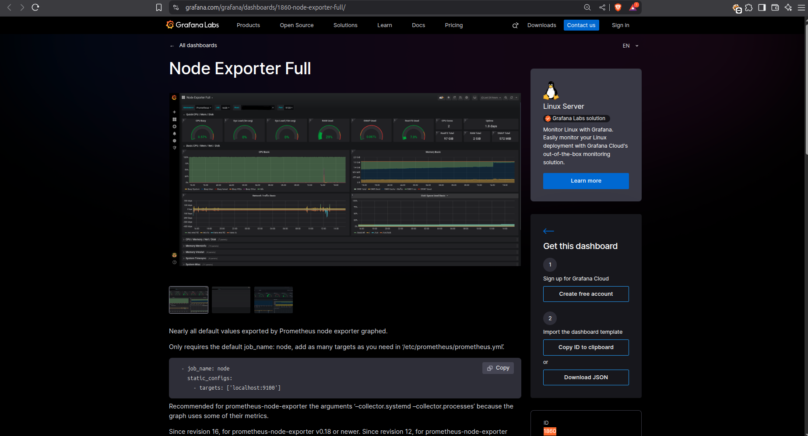

- Importamos el nuevo dashboard indicando su ID

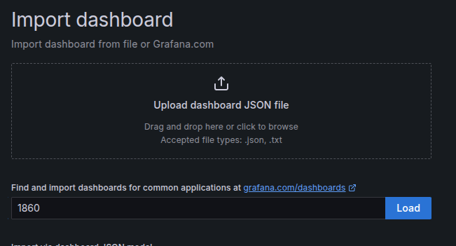

- Indicamos que los datos a tratar/visualizar provienen de Prometheus

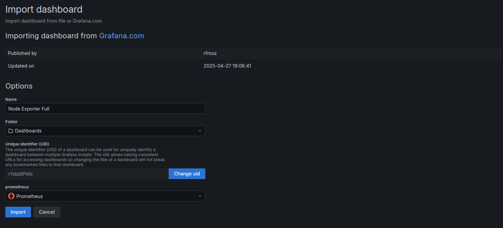

- Aplicamos los cambios y procedemos a la monitorización del equipo host
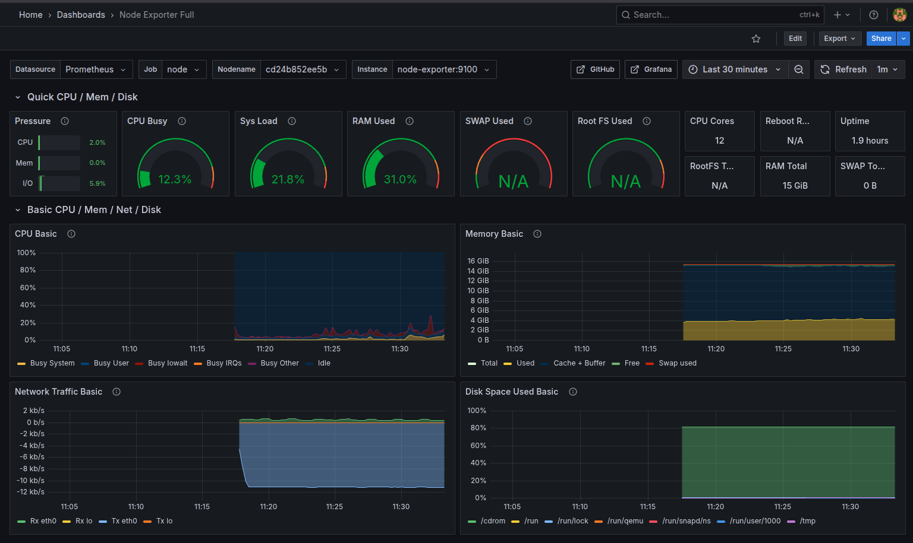

---

Este entorno permite centralizar la observabilidad de múltiples servicios en un único panel visual.
