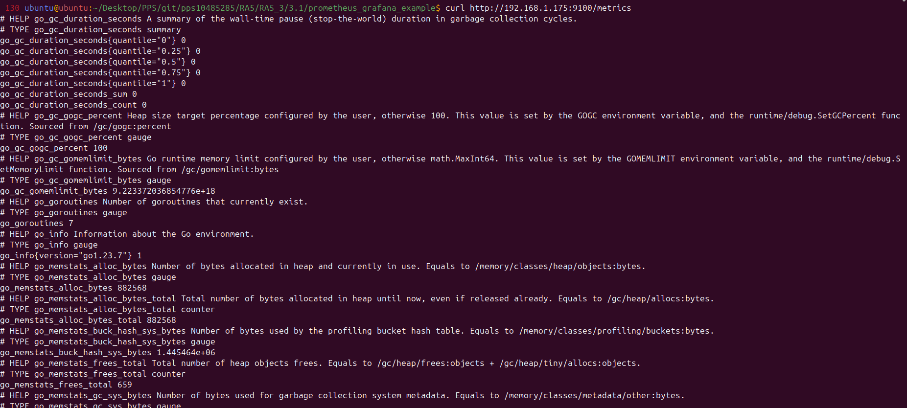

# Parte 3.2 - Monitorización de un Ubuntu Server remoto con Prometheus

Este README documenta cómo se configuró la monitorización de un servidor Ubuntu remoto utilizando Prometheus y Node Exporter.

## Requisitos previos

- Un servidor Ubuntu accesible por IP
- Docker y Docker Compose en el servidor de monitoreo
- Conectividad entre Prometheus y el nodo remoto (puerto 9100 expuesto) que en este caso, va a ser un sevidor virtualizado Ubuntu 24.04


## Pasos realizados

### 1. Instalación de Node Exporter en el servidor Ubuntu remoto

```bash
# Descargar y ejecutar Node Exporter
wget https://github.com/prometheus/node_exporter/releases/download/v1.9.1/node_exporter-1.9.1.linux-amd64.tar.gz
tar xvf node_exporter-1.9.1.linux-amd64.tar.gz
cd node_exporter-1.9.1.linux-amd64
./node_exporter &
```


> Hay que asegurarse de permitir el acceso al puerto 9100 en el firewall (UFW o similar):

```bash
sudo ufw allow 9100/tcp
```

Podemos comprobar que se obtiene la información deseada por parte del servidor a monitorizar:



Opcionalmente puedes ejecutar Node Exporter como un servicio con `systemd`.

### 2. Modificación de `prometheus.yml`

Vamos a añadir el nodo remoto a la configuración de Prometheus:

```yaml
scrape_configs:
  - job_name: 'ubuntu-remote'
    static_configs:
      - targets: ['192.168.1.175:9100']
```


### 3. Recarga de la configuración

Si Prometheus está ejecutandose con Docker, se necesita reiniciar el servicio para aplicar los cambios:

```bash
docker compose down
docker compose up -d
```

### 4. Verificación

- Ingresamos a la interfaz web de Prometheus en `http://localhost:9090`
- Ir a **Status > Targets** y confirmar que `ubuntu-remote` está marcado como UP


- En Grafana, importamos el mismo dashboard y seleccionamos el nuevo target


- Por último, podemos hacer un test de estres de la CPU para visualizar el estado del equipo en tiempo real:


---

Este procedimiento permite escalar la monitorización a cualquier cantidad de servidores remotos simplemente replicando la instalación de Node Exporter y agregando sus IPs a Prometheus.
