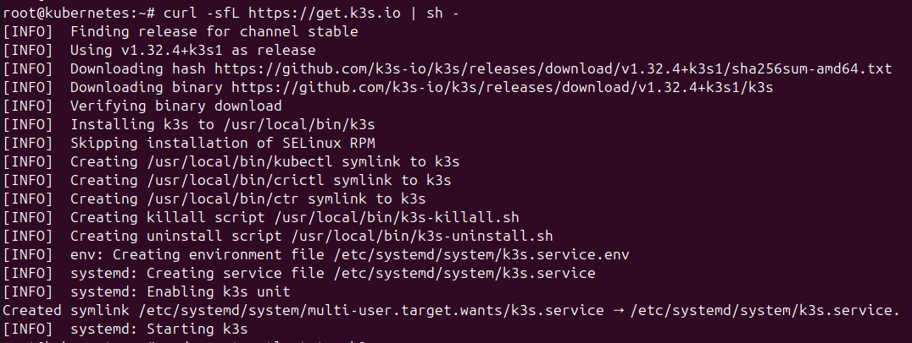
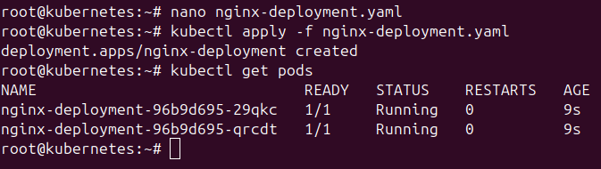

# 🐳 Práctica K3s + Nginx + K9s

## Descripción

Este repositorio contiene los pasos realizados para la instalación y configuración de un clúster K3s en modo single-node, así como el despliegue de un servicio nginx con 2 réplicas y la instalación de k9s para monitorización.

---

## 🔧 Requisitos

- 3 Máquinas virtuales Ubuntu Server 22.04 
- Acceso mediante SSH desde host
- Docker/K3s no preinstalado

---

## 📦 Instalación de K3s

```
curl -sfL https://get.k3s.io | sh -
```




Verificación:

```
kubectl get nodes
```


Para poder usar kubectl como usuario normal:

```
mkdir -p ~/.kube
sudo cp /etc/rancher/k3s/k3s.yaml ~/.kube/config
sudo chown $(id -u):$(id -g) ~/.kube/config
```


---

## 🚀 Despliegue de Nginx

Archivo: nginx-deployment.yaml

```
apiVersion: apps/v1
kind: Deployment
metadata:
  name: nginx-deployment
spec:
  replicas: 2
  selector:
    matchLabels:
      app: nginx
  template:
    metadata:
      labels:
        app: nginx
    spec:
      containers:
      - name: nginx
        image: nginx:latest
        ports:
        - containerPort: 80
```


Aplicar el deployment:

```
kubectl apply -f nginx-deployment.yaml
kubectl expose deployment nginx-deployment --type=NodePort --port=80
kubectl get service
```



---

## Acceso a Nginx


## 📊 Instalación de K9s

```
curl -LO https://github.com/derailed/k9s/releases/latest/download/k9s_Linux_amd64.tar.gz
tar -xvf k9s_Linux_amd64.tar.gz
sudo mv k9s /usr/local/bin/
```


Uso:

```
k9s
```


---
