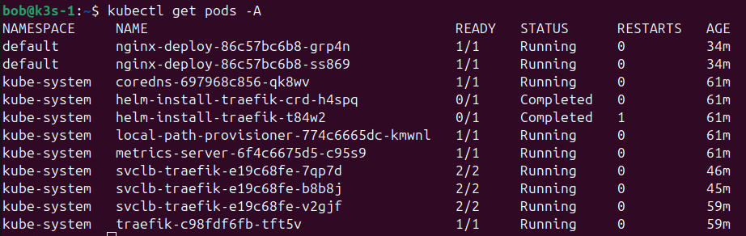

# Práctica Formativa: Despliegue de K3s en HA + nginx + K9s

## ✅ Objetivo

Instalar, configurar y validar un clúster K3s en **modo HA**, desplegar un servicio **nginx con 2 réplicas**, e instalar **K9s** en un servidor Ubuntu Server virtualizado. Las réplicas deben ser accesibles desde la red LAN del servidor.

---

## 🖥️ Infraestructura Requerida

- 3 nodos Ubuntu Server 24.04 (virtualizados)
- Conectados en la misma red LAN
- Acceso entre ellos por SSH

| Nodo   |          Rol         |      IP LAN      |
|--------|----------------------|------------------|
| k3s-1  | Servidor K3s (init)  | 192.168.1.185    |
| k3s-2  | Servidor K3s (join)  | 192.168.1.186    |
| k3s-3  | Agente (worker)      | 192.168.1.187    |

---

## 🔧 Fase 1: Instalación de K3s en modo HA

### En Nodo 1 (cluster-init)

```bash
curl -sfL https://get.k3s.io | INSTALL_K3S_EXEC="--cluster-init" sh -
```

Y obtener el token para compartir con el resto de equipos:

```bash
cat /var/lib/rancher/k3s/server/node-token
```


### En Nodo 2 (join como servidor)

```bash
curl -sfL https://get.k3s.io | K3S_URL=https://192.168.1.x:6443 K3S_TOKEN=<TOKEN> sh -
```


### En Nodo 3 (agente)

```bash
curl -sfL https://get.k3s.io | K3S_URL=https://192.168.1.x:6443 K3S_TOKEN=<TOKEN> sh -s - agent
```


---

## ✅ Fase 2: Validación del clúster

```bash
kubectl get nodes
kubectl get nodes -o wide
kubectl get pods -A
```




---

## 🚀 Fase 3: Deploy del servicio nginx con 2 réplicas

### Crear archivo `nginx-deploy.yaml`:

```yaml
apiVersion: apps/v1
kind: Deployment
metadata:
  name: nginx-deploy
spec:
  replicas: 2
  selector:
    matchLabels:
      app: nginx
  template:
    metadata:
      labels:
        app: nginx
    spec:
      containers:
      - name: nginx
        image: nginx
        ports:
        - containerPort: 80
---
apiVersion: v1
kind: Service
metadata:
  name: nginx-service
spec:
  type: NodePort
  selector:
    app: nginx
  ports:
  - port: 80
    targetPort: 80
    nodePort: 30080
```


### Aplicar el deployment:

```bash
kubectl apply -f nginx-deploy.yaml
```


### Verificar acceso desde LAN:

```bash
curl http://CUALQUIER_IP_NODOS:30080
```


---

## 🖥️ Fase 4: Instalación de K9s

### En uno de los nodos (ej. nodo1)

```bash
curl -sS https://webinstall.dev/k9s | sudo bash
source ~/.config/envman/PATH.env
sudo chmod 644 /etc/rancher/k3s/k3s.yaml
mkdir -p ~/.kube
sudo cp /etc/rancher/k3s/k3s.yaml ~/.kube/config
sudo chown bob:$(id -gn) ~/.kube/config
```


### Ejecutar K9s

```bash
k9s
```


---
