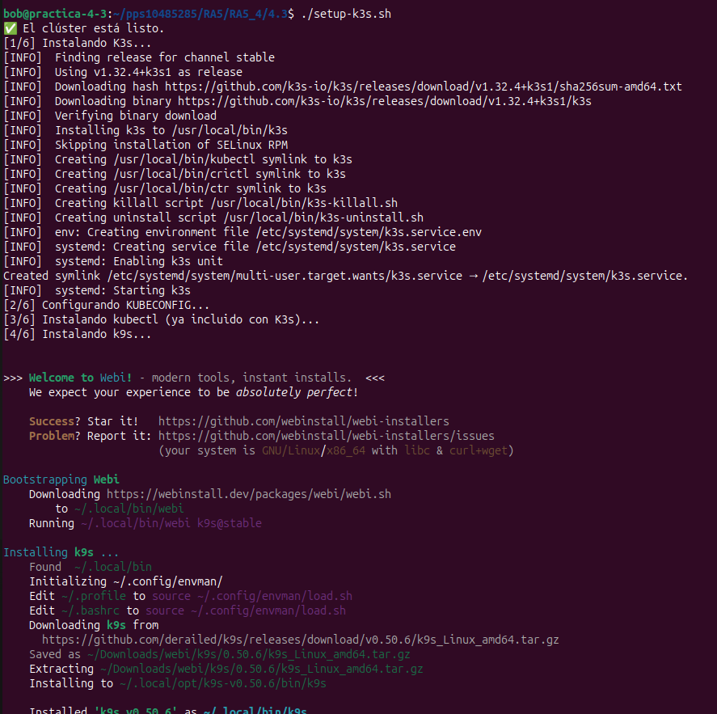
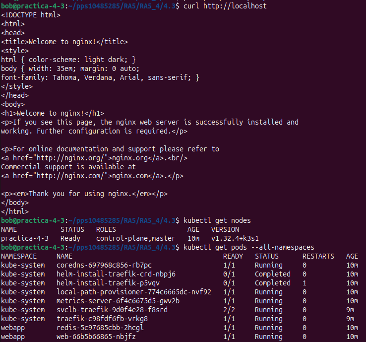
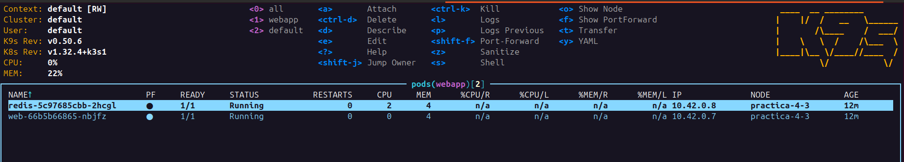

# Web + Redis on K3s with Traefik

## 📁 Estructura del proyecto

```bash
.
├── README.md
├── images
│   ├── 0.png
│   ├── 1.png
│   └── 2.png
├── k8s
│   ├── 01-namespace.yaml
│   ├── 02-web-deployment.yaml
│   ├── 03-redis-deployment.yaml
│   └── 04-ingress.yaml
└── setup-k3s.sh
```

## 🧪 Requisitos

- Tener Linux (Ubuntu/Debian/CentOS)
- Acceso a terminal con permisos sudo

## 🚀 Instalación automática

```bash
chmod +x setup-k3s.sh
./setup-k3s.sh
```



## Validación de servicios

```bash
kubectl get nodes

kubectl get pods --all-namespaces
```



## 🔍 Validación con K9s

```bash
/home/$USER/.local/bin/k9s
```
Acceder a Namespaces
```bash
:ns
```

Y visualizamos el apartado de WebApp
```bash
webapp
```



## 🌐 Acceso

- Accede a: http://localhost

O ejecuta desde un equipo en la misma red:

```
curl -H "Host: localhost" http://<IP-del-host>
```

## 🧹 Limpieza
```bash
kubectl delete namespace webapp
```
